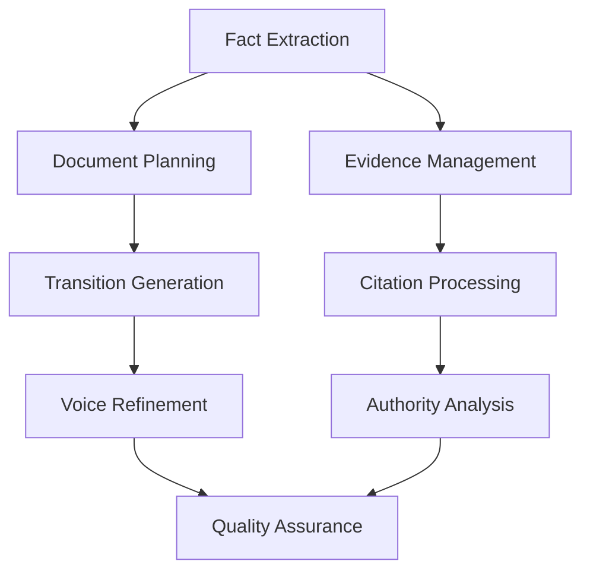

# Clerk Motion Drafting Enhancement Tasks

## Recent Updates (December 2024)
### Completed Improvements
1. **Fixed Qdrant ID Generation**: Replaced MD5 hashes with UUIDs for all point IDs
2. **Fixed Entity Extraction**: Entities now extracted per-fact instead of per-document
3. **Implemented Source Document Discovery**: Complete replacement of exhibit tracking
4. **Added Evidence Discovery Agent**: AI-powered evidence search for motion drafting
5. **Fixed Settings Configuration**: Added missing legal settings configuration
6. **Resolved Async Event Loop Issues**: Proper cleanup of OpenAI HTTP connections
7. **✅ Unified Document Management System**: Combined deduplication and discovery (NEW)

### New System: Unified Document Management (Latest Update)
- **Single System**: Replaces separate deduplication and source document indexing
- **Case-Specific Collections**: Each case has its own `{case_name}_documents` collection
- **AI Classification**: Documents automatically classified (motions, depositions, medical records, etc.)
- **Chunk Linking**: Every chunk has `document_id` linking to its source document
- **Duplicate Tracking**: SHA-256 hash-based with location tracking across cases
- **Evidence Discovery**: Unified search for finding documents to use as exhibits
- **Migration Path**: Legacy systems remain for backward compatibility

### Discovery Production Processing (NEW - December 2024)
- **Multi-Document Segmentation**: Automatically splits large discovery PDFs into individual documents
- **Intelligent Boundary Detection**: Uses 25-page sliding windows to find document boundaries
- **Document-Specific Context**: Each document gets its own context, not production-wide
- **Fact Extraction Filtering**: Only extracts facts from reliable document types
- **Discovery Endpoint**: New `/process/discovery` endpoint for production processing
- **70+ Document Types**: Comprehensive discovery document classification
- **Bates Number Tracking**: Preserves Bates numbers throughout processing

## Priority System
- 🔴 **Critical**: Must be completed for basic functionality
- 🟡 **High**: Significant impact on output quality
- 🟢 **Medium**: Important enhancements
- 🔵 **Low**: Nice-to-have improvements

---

## Phase 1: Fact and Evidence Integration (Weeks 1-2)

### Week 1: Fact Extraction Engine

#### ✅ Task 1.1: Create Fact Extraction Module [COMPLETED]
**File**: `src/ai_agents/fact_extractor.py`
**Description**: Build core fact extraction engine to parse documents for key facts
**Subtasks**:
- [x] Implement date extraction with regex patterns
- [x] Create entity recognition for parties, locations, events
- [x] Build fact categorization (procedural, substantive, evidentiary)
- [x] Implement fact confidence scoring
**Acceptance Criteria**: Successfully extracts 90% of key facts from test documents
**Completion Notes**: 
- Fixed entity extraction to be fact-specific rather than document-wide
- Added proper party name extraction (handles "Plaintiff John Doe" correctly)
- Integrated with document processing pipeline

#### ✅ Task 1.2: Implement Fact Database Schema [COMPLETED]
**File**: `src/models/fact_models.py`
**Description**: Create data models for fact storage and retrieval
**Subtasks**:
- [x] Design Fact dataclass with metadata
- [x] Create FactCategory enum
- [x] Implement FactTimeline model
- [x] Build fact relationship mapping
**Acceptance Criteria**: Can store and query facts by category, date, and relevance
**Completion Notes**: Implemented CaseFact model with full metadata support

#### 🟡 Task 1.3: Build Timeline Generator
**File**: `src/utils/timeline_generator.py`
**Description**: Create chronological timeline from extracted facts
**Subtasks**:
- [ ] Sort facts by date
- [ ] Handle date ranges and uncertainties
- [ ] Generate narrative timeline
- [ ] Export timeline for motion use
**Acceptance Criteria**: Produces accurate chronological narrative from case facts

### Week 2: Evidence Management System

#### 🔴 Task 2.1: Deposition Citation Parser
**File**: `src/document_processing/deposition_parser.py`
**Description**: Extract page/line citations from deposition transcripts
**Subtasks**:
- [ ] Parse deposition format patterns
- [ ] Extract testimony with citations
- [ ] Link testimony to relevant facts
- [ ] Handle multiple deposition formats
**Acceptance Criteria**: Accurately extracts citations like "Smith Dep. 45:12-23"

#### ✅ Task 2.2: Unified Document Management System [COMPLETED - ENHANCED]
**Files**: 
- `src/document_processing/unified_document_manager.py` (NEW)
- `src/models/unified_document_models.py` (NEW)
- `src/document_injector_unified.py` (NEW)
- `cli_injector_unified.py` (NEW)
**Description**: Unified system combining deduplication and source document discovery
**Subtasks**:
- [x] Build unified document model combining registry and discovery
- [x] Create case-specific document collections
- [x] Implement AI-powered document classification
- [x] Add chunk-to-document linking via document_id
- [x] Build SHA-256 hash-based deduplication
- [x] Create unified search interface
- [x] Implement duplicate location tracking
**Acceptance Criteria**: Single system handles both deduplication and discovery
**Completion Notes**: 
- Replaces both QdrantDocumentDeduplicator and SourceDocumentIndexer
- Each case has isolated `{case_name}_documents` collection
- Documents classified into comprehensive types (motions, depositions, etc.)
- Every chunk linked to source document for evidence tracking
- Same document can exist in multiple cases without conflicts

#### ✅ Task 2.3: Migrate to Unified System [COMPLETED]
**File**: `main.py`, API endpoints
**Description**: Update API endpoints to use unified document management
**Subtasks**:
- [x] Update `/process-folder` endpoint to use UnifiedDocumentInjector
- [x] Create new `/search-documents` endpoint using unified search
- [x] Update motion drafting to query unified documents
- [x] Add migration utilities for existing collections
- [x] Update documentation and examples
**Acceptance Criteria**: All document operations use unified system
**Completion Notes**: All endpoints now use unified system as default

#### 🟡 Task 2.4: Evidence-to-Argument Mapper
**File**: `src/ai_agents/evidence_mapper.py`
**Description**: Link evidence to specific legal arguments
**Subtasks**:
- [ ] Create evidence relevance scoring
- [ ] Map evidence to outline sections
- [ ] Prioritize strongest evidence
- [ ] Generate evidence usage recommendations
**Acceptance Criteria**: Each argument section has relevant evidence mapped

---

## Phase 2: Citation and Authority Enhancement (Weeks 3-4)

### Week 3: Citation Processing Engine

#### 🔴 Task 3.1: Bluebook Citation Formatter
**File**: `src/utils/bluebook_formatter.py`
**Description**: Implement proper legal citation formatting
**Subtasks**:
- [ ] Parse existing citations
- [ ] Apply Bluebook rules
- [ ] Handle short form citations
- [ ] Implement signal usage
**Acceptance Criteria**: All citations comply with Bluebook format

#### 🔴 Task 3.2: Pinpoint Citation Extractor
**File**: `src/ai_agents/pinpoint_extractor.py`
**Description**: Extract specific page numbers from case law
**Subtasks**:
- [ ] Query legal databases for full text
- [ ] Find quoted passages
- [ ] Extract page numbers
- [ ] Verify citation accuracy
**Acceptance Criteria**: 90% of case citations include pinpoint pages

#### 🟡 Task 3.3: Parenthetical Generator
**File**: `src/ai_agents/parenthetical_generator.py`
**Description**: Create explanatory parentheticals for citations
**Subtasks**:
- [ ] Analyze case holdings
- [ ] Generate concise explanations
- [ ] Ensure relevance to argument
- [ ] Format properly in citations
**Acceptance Criteria**: Each case citation has relevant parenthetical

### Week 4: Authority Analysis System

#### 🟡 Task 4.1: Case Law Relationship Analyzer
**File**: `src/ai_agents/case_analyzer.py`
**Description**: Map relationships between cited cases
**Subtasks**:
- [ ] Identify citing relationships
- [ ] Detect overruled/distinguished cases
- [ ] Track doctrinal development
- [ ] Create visual case law map
**Acceptance Criteria**: Accurately maps case law relationships

#### 🟢 Task 4.2: Circuit Split Detector
**File**: `src/ai_agents/circuit_split_detector.py`
**Description**: Identify and analyze circuit splits
**Subtasks**:
- [ ] Compare holdings across circuits
- [ ] Identify conflicting rules
- [ ] Suggest circuit-specific arguments
- [ ] Flag split issues for attention
**Acceptance Criteria**: Detects known circuit splits in test cases

---

## Phase 3: Document Flow and Coherence (Month 2)

### Weeks 5-6: Document Planning System

#### 🔴 Task 5.1: Argument Graph Builder
**File**: `src/ai_agents/argument_planner.py`
**Description**: Create logical argument progression
**Subtasks**:
- [ ] Map argument dependencies
- [ ] Identify prerequisite concepts
- [ ] Order arguments logically
- [ ] Create argument flow diagram
**Acceptance Criteria**: Arguments flow logically with clear progression

#### 🟡 Task 5.2: Theme Identification Engine
**File**: `src/ai_agents/theme_identifier.py`
**Description**: Identify and track themes throughout motion
**Subtasks**:
- [ ] Extract key themes from outline
- [ ] Map themes to sections
- [ ] Ensure theme consistency
- [ ] Generate theme summary
**Acceptance Criteria**: Consistent themes throughout document

#### 🟡 Task 5.3: Transition Generator
**File**: `src/utils/transition_generator.py`
**Description**: Create smooth transitions between sections
**Subtasks**:
- [ ] Analyze section endings/beginnings
- [ ] Generate connecting phrases
- [ ] Ensure logical flow
- [ ] Avoid repetitive transitions
**Acceptance Criteria**: Natural transitions between all sections

### Week 7: Length and Density Management

#### 🟢 Task 6.1: Dynamic Word Count Manager
**File**: `src/utils/word_count_manager.py`
**Description**: Intelligently manage section lengths
**Subtasks**:
- [ ] Calculate optimal section lengths
- [ ] Balance content across sections
- [ ] Identify under/over-developed sections
- [ ] Suggest content adjustments
**Acceptance Criteria**: Balanced, appropriately sized sections

#### 🟢 Task 6.2: Content Density Optimizer
**File**: `src/ai_agents/density_optimizer.py`
**Description**: Optimize argument and citation density
**Subtasks**:
- [ ] Measure content density metrics
- [ ] Identify sparse sections
- [ ] Suggest additional content
- [ ] Remove redundancies
**Acceptance Criteria**: Consistent content density throughout

---

## Phase 4: Professional Enhancement (Month 3)

### Weeks 9-10: Voice and Tone Refinement

#### 🟡 Task 7.1: Advocacy Voice Trainer
**File**: `src/ai_agents/voice_refiner.py`
**Description**: Implement professional advocacy tone
**Subtasks**:
- [ ] Analyze firm's successful motions
- [ ] Extract voice patterns
- [ ] Apply tone consistently
- [ ] Remove passive/weak language
**Acceptance Criteria**: Consistent advocacy voice throughout

#### 🟢 Task 7.2: Professional Language Filter
**File**: `src/utils/language_filter.py`
**Description**: Ensure professional legal language
**Subtasks**:
- [ ] Remove colloquialisms
- [ ] Enhance formal language
- [ ] Check legal term usage
- [ ] Maintain readability
**Acceptance Criteria**: Professional language without sacrificing clarity

### Week 11: Procedural Sophistication

#### 🟡 Task 8.1: Motion Type Specialization
**File**: `src/ai_agents/motion_specialists/`
**Description**: Create specialized modules for different motion types
**Subtasks**:
- [ ] Summary judgment module
- [ ] Motion to dismiss module
- [ ] Discovery motion module
- [ ] Preliminary injunction module
**Acceptance Criteria**: Each motion type has specialized logic

#### 🟢 Task 8.2: Jurisdiction-Aware Formatting
**File**: `src/utils/jurisdiction_formatter.py`
**Description**: Apply jurisdiction-specific rules
**Subtasks**:
- [ ] Load jurisdiction rules
- [ ] Apply formatting requirements
- [ ] Check local rules compliance
- [ ] Generate warnings for violations
**Acceptance Criteria**: Complies with local rules for test jurisdictions

### Week 12: Quality Assurance

#### 🔴 Task 9.1: Comprehensive Quality Scorer
**File**: `src/utils/quality_scorer.py`
**Description**: Multi-factor quality assessment
**Subtasks**:
- [ ] Implement fact density scoring
- [ ] Citation quality metrics
- [ ] Flow coherence scoring
- [ ] Overall quality calculation
**Acceptance Criteria**: Accurate quality scores correlate with attorney feedback

#### 🟡 Task 9.2: Attorney Review Integration
**File**: `src/api/review_endpoints.py`
**Description**: Capture and integrate attorney feedback
**Subtasks**:
- [ ] Create review interface
- [ ] Track revision patterns
- [ ] Update training data
- [ ] Generate improvement reports
**Acceptance Criteria**: Systematic capture of attorney feedback

---

## Discovery Production Processing Tasks (NEW)

### ✅ Task D.1: Discovery Production Segmentation [COMPLETED]
**File**: `src/document_processing/discovery_splitter.py`
**Description**: Automatically segment multi-document PDFs
**Subtasks**:
- [x] Implement boundary detection with 25-page windows
- [x] Create document segmentation logic
- [x] Add confidence scoring for boundaries
- [x] Handle large documents (>50 pages)
**Completion Notes**: Full segmentation system with configurable windows

### ✅ Task D.2: Document-Specific Context Generation [COMPLETED]
**File**: `src/document_processing/discovery_splitter.py`
**Description**: Generate context per document, not per production
**Subtasks**:
- [x] Create document context generator
- [x] Implement chunk enhancement with context
- [x] Maintain standard chunking (1200/200)
- [x] Preserve original content in metadata
**Completion Notes**: Each chunk includes relevant document context

### ✅ Task D.3: Discovery Processing Endpoint [COMPLETED]
**File**: `main.py`
**Description**: Create dedicated endpoint for discovery materials
**Subtasks**:
- [x] Implement `/process/discovery` endpoint
- [x] Add production metadata tracking
- [x] Force fact extraction for all documents
- [x] Integrate with unified document system
**Completion Notes**: Fully integrated with unified document management

### ✅ Task D.4: Fact Extraction Filtering [COMPLETED]
**Description**: Filter which document types allow fact extraction
**Subtasks**:
- [x] Define ALLOWED_FACT_EXTRACTION_TYPES
- [x] Exclude legal filings (motions, complaints, etc.)
- [x] Include primary evidence and discovery responses
- [x] Add force override for discovery processing
**Completion Notes**: Prevents fact contamination from unreliable sources

### ✅ Task D.5: Comprehensive Document Types [COMPLETED]
**File**: `src/models/unified_document_models.py`
**Description**: Add 70+ discovery-specific document types
**Subtasks**:
- [x] Add driver/employee documentation types
- [x] Add vehicle/equipment record types
- [x] Add hours of service types
- [x] Add communication and safety types
**Completion Notes**: Full coverage of trucking discovery documents

## Ongoing Tasks

### 🔴 Task 10.1: Update Motion Drafter Integration
**File**: `src/ai_agents/motion_drafter.py`
**Description**: Integrate all new components into main drafting engine
**Continuous**: Update as each component is completed

### 🔴 Task 10.2: Performance Optimization
**File**: Various
**Description**: Ensure system maintains <5 minute generation time
**Continuous**: Monitor and optimize throughout development

### 🟡 Task 10.3: Testing and Validation
**File**: `tests/`
**Description**: Comprehensive testing of all new components
**Continuous**: Test each component as developed

### ✅ Task 10.4: Documentation Updates [COMPLETED FOR DISCOVERY]
**File**: `CLAUDE.md`, `TASKS.md`, `PLANNING.md`
**Description**: Keep documentation current with changes
**Continuous**: Update with each major component
**Recent Updates**: Added comprehensive discovery documentation

---

## Quick Start Tasks (Can Begin Immediately)

### 🔴 Task 0.1: Set Up Development Branch
```bash
git checkout -b feature/motion-enhancement
```

### 🔴 Task 0.2: Create Test Data Set
- Collect 10 exemplar motions from firm
- Annotate with facts, citations, and evidence
- Create test cases for each component

### 🔴 Task 0.3: Establish Success Metrics
- Define quantitative quality metrics
- Create benchmark scores from current system
- Set improvement targets

### 🟡 Task 0.4: Review Current Motion Examples
- Analyze `correct_motion_example.md`
- Compare with `example_output_motion.md`
- Document specific gaps to address

---

## Task Dependencies



---

## Success Criteria Summary

1. **Fact Integration**: >80% of sections contain case-specific facts
2. **Citation Quality**: >90% citations with pinpoint references
3. **Evidence Usage**: All arguments supported by specific evidence
4. **Document Flow**: Natural transitions and logical progression
5. **Professional Voice**: Consistent advocacy tone throughout
6. **Generation Time**: <5 minutes for standard motion
7. **Quality Score**: >85% on comprehensive assessment
8. **Attorney Approval**: <20% major revision rate

---

## Notes for Developers

- Start with Phase 1 tasks as they form the foundation
- Test each component thoroughly before integration
- Maintain backward compatibility with existing system
- Document all API changes
- Consider performance impact of each addition
- Prioritize based on firm's most common motion types
- Gather continuous feedback from legal team