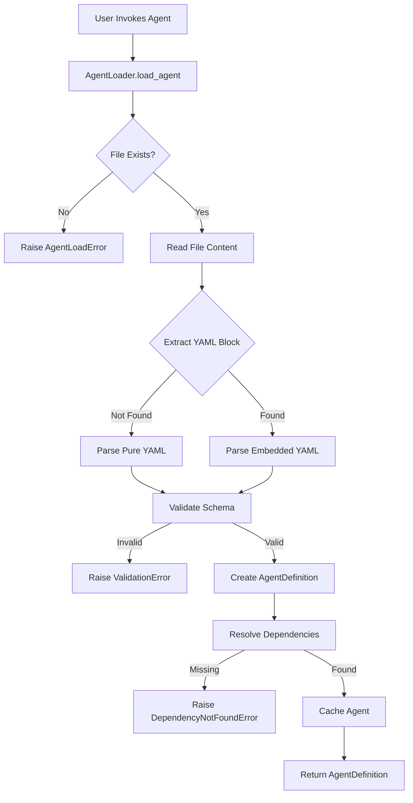
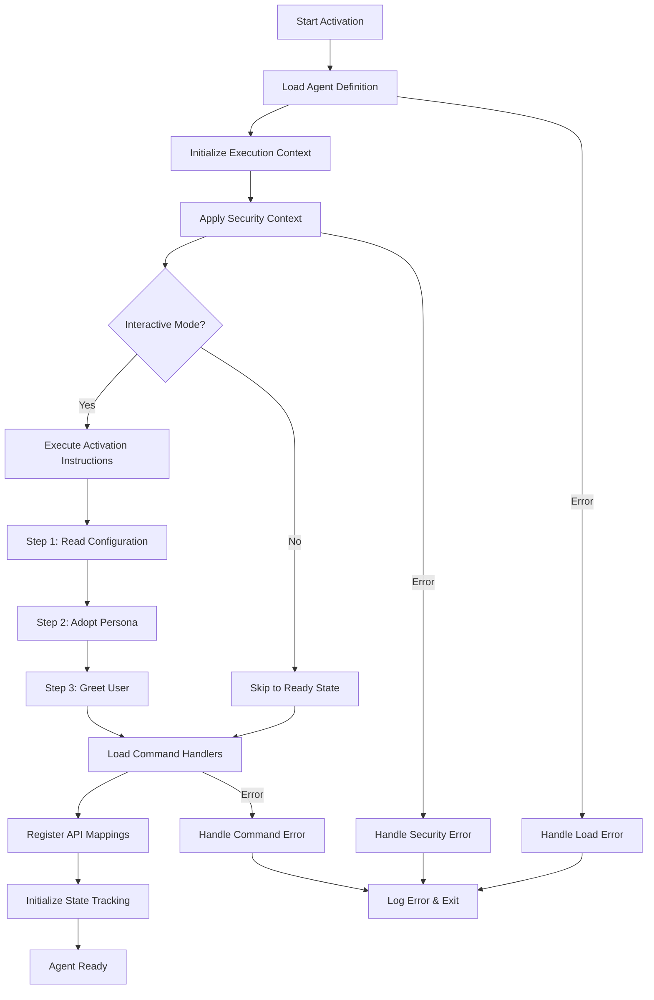
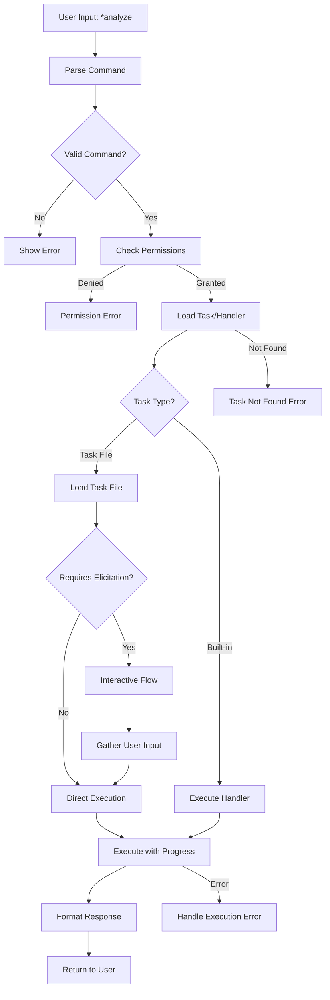
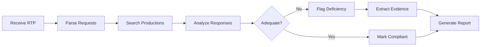

# BMad Legal AI Agent Creation Guide

This comprehensive guide covers the complete lifecycle of creating, defining, activating, and utilizing legal AI agents using the BMad framework.

## Table of Contents

1. [Agent Creation Phase](#1-agent-creation-phase)
2. [Agent Definition Phase](#2-agent-definition-phase)
3. [Agent Activation Phase](#3-agent-activation-phase)
4. [Agent Utilization Phase](#4-agent-utilization-phase)
5. [Legal Agent Creation Walkthrough](#5-legal-agent-creation-walkthrough)
6. [BMad Best Practices](#6-bmad-best-practices)
7. [Example Legal Agents](#7-example-legal-agents)
8. [Migration and Optimization](#8-migration-and-optimization)

---

## 1. Agent Creation Phase

### Using the BMad Create-Agent Task

The BMad framework provides an interactive task for creating new agents. This ensures consistency and completeness.

#### Invocation

```bash
# From the project root, execute:
claude-code /BMad:tasks:create-agent
```

#### Interactive Prompts

The create-agent task will guide you through:

1. **Agent Name**: Human-readable name (e.g., "Discovery Analyzer")
2. **Agent ID**: Unique identifier (e.g., "discovery-analyzer")
3. **Title**: Professional title (e.g., "Legal Discovery Analysis Specialist")
4. **Icon**: Emoji representation (e.g., "🔍")
5. **When to Use**: Usage guidance for the agent
6. **Customization**: Additional behavioral modifications

#### Output Structure

The task generates:
- Agent definition file: `Clerk/src/ai_agents/bmad-framework/agents/{agent-id}.md`
- Initial task files in `tasks/` directory
- Template stubs in `templates/` directory

### Agent Creation Checklist

Before creating an agent, ensure you have:

- [ ] Clear understanding of the agent's purpose
- [ ] Identified all required commands
- [ ] Listed necessary dependencies (tasks, templates, checklists)
- [ ] Determined integration points with existing services
- [ ] Defined security requirements

### ID Generation Patterns

Agent IDs follow these conventions:

```
{domain}-{function}-{version}
```

Examples:
- `discovery-analyzer` - Discovery analysis agent
- `letter-generator` - Legal letter generation
- `compliance-checker-v2` - Version 2 of compliance checking

#### Namespace Conventions

Legal agents use these namespaces:
- `discovery-*` - Discovery-related agents
- `motion-*` - Motion drafting agents
- `letter-*` - Letter generation agents
- `research-*` - Legal research agents
- `compliance-*` - Compliance verification agents

#### Conflict Resolution

If an ID already exists:
1. Add version suffix (e.g., `-v2`, `-enhanced`)
2. Use more specific function name
3. Consider subdomain prefix

### Creation Examples

#### Basic Agent Creation

```yaml
# Minimal agent for simple document analysis
activation-instructions:
  - STEP 1: Read THIS ENTIRE FILE
  - STEP 2: Adopt persona
  - STEP 3: Greet user

agent:
  name: Doc Analyzer
  id: doc-analyzer
  title: Document Analyst

persona:
  role: Document analysis specialist

commands:
  - help: Show commands
  - analyze: Analyze document
```

#### Advanced Agent Creation

```yaml
# Full-featured discovery agent
activation-instructions:
  - STEP 1: Read THIS ENTIRE FILE
  - STEP 2: Adopt persona defined below
  - STEP 3: Greet with name and role
  - STEP 4: Load security context
  - CRITICAL: Maintain case isolation

agent:
  name: Discovery Specialist
  id: discovery-specialist-v3
  title: Senior Discovery Analysis Expert
  icon: 🔍
  whenToUse: Complex discovery analysis with ML
  customization: "Enhanced with GPT-4 capabilities"

persona:
  role: Expert legal analyst
  style: Precise, thorough, legally astute
  identity: 20+ years discovery experience
  focus: Deficiency identification
  core_principles:
    - Accuracy above all
    - Complete coverage
    - Clear documentation

commands:
  - help: Show all available commands
  - analyze: Deep analysis of discovery
  - search: Semantic search with context
  - report: Generate comprehensive report

dependencies:
  tasks:
    - analyze-rtp.md
    - ml-document-analysis.md
  templates:
    - discovery-report-tmpl.yaml
  checklists:
    - pre-analysis-validation.md
```

### Common Creation Errors

1. **Duplicate IDs**: Check existing agents first
2. **Missing Required Fields**: Use checklist above
3. **Invalid YAML**: Validate syntax before saving
4. **Circular Dependencies**: Avoid task A requiring task B requiring task A

---

## 2. Agent Definition Phase

### YAML Structure Guide

#### Activation Instructions Block

```yaml
activation-instructions:
  # Required steps for agent startup
  - STEP 1: Read THIS ENTIRE FILE - contains complete persona
  - STEP 2: Adopt persona defined in agent and persona sections
  - STEP 3: Greet user with name/role and available commands
  
  # Optional advanced instructions
  - STEP 4: Load case context if provided
  - STEP 5: Initialize security boundaries
  
  # Critical behavioral rules
  - CRITICAL: Maintain case isolation at all times
  - DO NOT: Load external files during activation
  - ONLY: Load dependencies when executing commands
```

Examples of activation variations:

```yaml
# Minimal activation
activation-instructions:
  - Read and adopt persona
  - Greet user

# Security-focused activation
activation-instructions:
  - STEP 1: Read complete configuration
  - STEP 2: Validate security context
  - STEP 3: Adopt secure persona
  - CRITICAL: No cross-case data access

# Multi-mode activation
activation-instructions:
  - STEP 1: Read configuration
  - STEP 2: Check execution mode (interactive/API)
  - STEP 3: Adopt appropriate persona
  - IF API: Skip greeting, await commands
  - IF Interactive: Greet and show help
```

#### Agent Metadata Block

```yaml
agent:
  name: string        # Human-readable name (required)
  id: string         # Unique identifier (required)
  title: string      # Professional title (optional)
  icon: string       # Emoji representation (optional)
  whenToUse: string  # Usage guidance (optional)
  customization: string  # Behavioral overrides (optional)
  version: string    # Semantic version (optional)
  author: string     # Creator attribution (optional)
  tags: [string]     # Categorization tags (optional)
```

Field specifications:
- `name`: 3-50 characters, no special chars except spaces
- `id`: 3-50 characters, lowercase, hyphens only
- `title`: Up to 100 characters
- `icon`: Single emoji character
- `whenToUse`: Up to 200 characters
- `customization`: Detailed override instructions
- `version`: SemVer format (e.g., "1.2.3")
- `tags`: Array of lowercase strings

#### Persona Block

```yaml
persona:
  role: string              # Core role description (required)
  style: string            # Communication style (optional)
  identity: string         # Background/experience (optional)
  focus: string           # Primary areas of focus (optional)
  core_principles: [string]  # Guiding principles (optional)
  constraints: [string]    # Behavioral limitations (optional)
  expertise: [string]      # Areas of expertise (optional)
```

Style examples:
- "Precise, methodical, detail-oriented"
- "Friendly but professional, clear communicator"
- "Direct, no-nonsense, results-focused"

#### Commands Block

```yaml
commands:
  - command: description     # Simple format
  
  # Advanced format with parameters
  - analyze:
      description: Analyze discovery documents
      parameters:
        - name: document_id
          type: string
          required: true
        - name: depth
          type: enum[shallow|deep]
          default: deep
```

Command naming conventions:
- Use verbs: `analyze`, `search`, `generate`, `validate`
- Be specific: `analyze-rtp` not just `analyze`
- Keep short: 1-3 words maximum
- No special characters except hyphens

#### Dependencies Block

```yaml
dependencies:
  tasks:          # Task files (.md)
    - analyze-rtp.md
    - search-production.md
    
  templates:      # Template files (.yaml)
    - motion-tmpl.yaml
    - letter-tmpl.yaml
    
  checklists:     # Checklist files (.md)
    - validation-checklist.md
    
  data:          # Data files (.json)
    - jurisdiction-rules.json
    
  utils:         # Utility files
    - legal-formatter.py
```

### YAML Validation Requirements

#### Required Sections

```yaml
# Minimal valid agent
activation-instructions: [...]  # Required
agent:                         # Required
  name: string                 # Required
  id: string                   # Required
persona:                       # Required
  role: string                 # Required
commands: [...]                # Required
```

#### Field Type Specifications

```yaml
# String fields
name: "Agent Name"

# Array fields
commands:
  - help: Show help
  - analyze: Run analysis

# Object fields
parameters:
  document_id:
    type: string
    required: true

# Enum fields
status: pending|active|deprecated
```

#### Character Limits

- Agent name: 50 characters
- Agent ID: 50 characters
- Command names: 30 characters
- Descriptions: 200 characters
- Activation instructions: 100 chars/line

### Troubleshooting Guide

#### Common YAML Errors

1. **Indentation Error**
   ```yaml
   # Wrong
   agent:
   name: Test
   
   # Correct
   agent:
     name: Test
   ```

2. **Missing Quotes**
   ```yaml
   # Wrong
   description: Analyze docs: fast
   
   # Correct
   description: "Analyze docs: fast"
   ```

3. **Invalid Characters**
   ```yaml
   # Wrong
   id: discovery@analyzer
   
   # Correct
   id: discovery-analyzer
   ```

#### Validation Error Messages

- `Missing required field: agent.name` - Add name field
- `Invalid ID format` - Use lowercase and hyphens only
- `Duplicate command: analyze` - Each command must be unique
- `Circular dependency detected` - Check task dependencies

#### Debug Techniques

1. **YAML Linting**
   ```bash
   # Validate YAML syntax
   python -m yaml agent-definition.md
   ```

2. **Schema Validation**
   ```python
   from bmad_framework import validate_agent
   validate_agent("path/to/agent.md")
   ```

3. **Verbose Loading**
   ```python
   loader = AgentLoader(debug=True)
   agent = loader.load_agent("my-agent")
   ```

### Definition Templates

#### Minimal Agent

```yaml
activation-instructions:
  - Read and adopt persona
  - Greet user

agent:
  name: Basic Agent
  id: basic-agent

persona:
  role: Simple task executor

commands:
  - help: Show commands
  - execute: Run task
```

#### Full-Featured Agent

```yaml
activation-instructions:
  - STEP 1: Read THIS ENTIRE FILE
  - STEP 2: Adopt complete persona
  - STEP 3: Initialize case context
  - STEP 4: Greet with capabilities
  - CRITICAL: Maintain isolation

agent:
  name: Advanced Legal Agent
  id: advanced-legal-v2
  title: Senior Legal Analysis Expert
  icon: ⚖️
  whenToUse: Complex legal document analysis
  customization: "Enhanced with domain expertise"
  version: "2.1.0"
  author: "Legal AI Team"
  tags: ["discovery", "analysis", "ml-enhanced"]

persona:
  role: Expert legal analyst with litigation focus
  style: Precise, thorough, legally astute
  identity: Former litigator with 20 years experience
  focus: Discovery deficiencies and compliance
  core_principles:
    - Accuracy and verifiability
    - Complete case coverage
    - Clear legal reasoning
    - Ethical compliance
  constraints:
    - No legal advice
    - Case isolation required
    - Audit trail mandatory
  expertise:
    - Federal discovery rules
    - State procedural law
    - Document analysis
    - Deficiency identification

commands:
  - help: Display all available commands
  - analyze:
      description: Deep analysis of discovery
      parameters:
        - name: rtp_id
          type: string
          required: true
        - name: production_id
          type: string
          required: true
  - search: Semantic search across productions
  - categorize: Classify compliance status
  - report: Generate deficiency report
  - evidence: Extract supporting chunks
  - validate: Verify analysis results

dependencies:
  tasks:
    - analyze-rtp.md
    - search-production.md
    - categorize-compliance.md
    - extract-evidence.md
    - validate-results.md
  templates:
    - deficiency-report-tmpl.yaml
    - evidence-citation-tmpl.yaml
    - compliance-matrix-tmpl.yaml
  checklists:
    - pre-analysis-validation.md
    - deficiency-categories.md
    - post-analysis-review.md
  data:
    - federal-rules.json
    - state-rules-fl.json
    - objection-patterns.json
  utils:
    - legal_citation_formatter.py
    - date_calculator.py
```

#### Domain-Specific Variations

```yaml
# Motion Drafter Agent
agent:
  name: Motion Drafter
  id: motion-drafter
  tags: ["motion", "drafting", "generation"]

# Letter Generator Agent  
agent:
  name: Letter Generator
  id: letter-generator
  tags: ["correspondence", "generation"]

# Research Agent
agent:
  name: Legal Researcher
  id: legal-researcher
  tags: ["research", "case-law", "analysis"]
```

---

## 3. Agent Activation Phase

### Loading Sequence

The agent activation follows this precise sequence:



#### File Discovery Process

1. Check exact path: `agents/{agent_id}.md`
2. Check with extension: `agents/{agent_id}.yaml`
3. Check alternate formats: `agents/{agent_id}.yml`
4. Search recursively in agents directory
5. Raise `AgentLoadError` if not found

#### YAML Parsing Steps

```python
# 1. Read file
content = Path(agent_path).read_text()

# 2. Check for embedded YAML
if "```yaml" in content:
    # Extract between markers
    yaml_content = extract_yaml_block(content)
else:
    # Pure YAML file
    yaml_content = content

# 3. Parse YAML
data = yaml.safe_load(yaml_content)

# 4. Validate structure
validate_agent_schema(data)
```

#### Dependency Resolution Order

1. **Tasks**: Load from `tasks/` directory
2. **Templates**: Load from `templates/` directory
3. **Checklists**: Load from `checklists/` directory
4. **Data**: Load from `data/` directory
5. **Utils**: Import from `utils/` directory

Resolution algorithm:
```python
def resolve_dependency(dep_type: str, dep_name: str):
    search_paths = [
        f"bmad-framework/{dep_type}/{dep_name}",
        f".bmad-core/{dep_type}/{dep_name}",
        f"/{dep_type}/{dep_name}"
    ]
    for path in search_paths:
        if path.exists():
            return load_file(path)
    raise DependencyNotFoundError(dep_name)
```

#### Memory Allocation

- Agent definitions cached after first load
- Cache key: `{agent_id}:{file_mtime}`
- Memory limit: 100 cached agents
- LRU eviction policy

### Activation Flowchart



### Persona Adoption Mechanics

#### Identity Assumption

```python
class AgentPersona:
    def adopt(self, agent_def: AgentDefinition):
        # 1. Set communication style
        self.style = agent_def.persona.style
        
        # 2. Load expertise domains
        self.expertise = agent_def.persona.expertise
        
        # 3. Apply behavioral constraints
        self.constraints = agent_def.persona.constraints
        
        # 4. Initialize response patterns
        self.init_response_patterns()
```

#### Context Switching

```python
class AgentContextManager:
    def switch_context(self, from_agent: str, to_agent: str):
        # 1. Save current state
        self.save_agent_state(from_agent)
        
        # 2. Clear active context
        self.clear_context()
        
        # 3. Load new agent
        new_agent = self.load_agent(to_agent)
        
        # 4. Restore relevant state
        self.restore_shared_state(new_agent)
```

#### State Preservation

```python
class AgentState:
    def preserve(self):
        return {
            "conversation_history": self.history,
            "active_case": self.case_context,
            "command_stack": self.commands,
            "working_memory": self.memory
        }
    
    def restore(self, state: dict):
        self.history = state["conversation_history"]
        self.case_context = state["active_case"]
        # Selective restoration
```

### Activation Examples

#### Standard Activation

```python
from bmad_framework import AgentLoader, AgentExecutor

# Load agent
loader = AgentLoader()
agent_def = await loader.load_agent("discovery-analyzer")

# Create execution context
executor = AgentExecutor()
context = await executor.create_context(
    agent_def=agent_def,
    case_name="Smith_v_Jones_2024"
)

# Activate agent
await executor.activate(context)
```

#### Custom Activation

```python
# Custom activation with overrides
activation_config = {
    "skip_greeting": True,
    "api_mode": True,
    "security_level": "enhanced"
}

context = await executor.create_context(
    agent_def=agent_def,
    case_name="Smith_v_Jones_2024",
    activation_config=activation_config
)
```

#### Debugging Activation Failures

```python
# Enable debug logging
import logging
logging.getLogger("bmad_framework").setLevel(logging.DEBUG)

try:
    agent_def = await loader.load_agent("my-agent")
except AgentLoadError as e:
    print(f"Load failed: {e}")
    print(f"Searched paths: {e.search_paths}")
    print(f"File exists: {e.file_exists}")
    
# Validate before activation
validation_errors = agent_def.validate()
if validation_errors:
    print("Validation errors:", validation_errors)
```

---

## 4. Agent Utilization Phase

### Command Execution Flow



### Command Parsing and Validation

```python
class CommandParser:
    def parse(self, user_input: str) -> ParsedCommand:
        # Remove * prefix
        if not user_input.startswith("*"):
            raise InvalidCommandError("Commands must start with *")
        
        parts = user_input[1:].split()
        command = parts[0]
        args = parts[1:] if len(parts) > 1 else []
        
        # Validate against agent commands
        if command not in self.agent_def.commands:
            # Try fuzzy matching
            match = self.fuzzy_match(command)
            if match:
                command = match
            else:
                raise CommandNotFoundError(command)
        
        return ParsedCommand(command=command, args=args)
```

### Task Routing Decision Tree

```python
def route_command(self, command: str) -> TaskRouter:
    # 1. Check built-in handlers
    if command in self.builtin_handlers:
        return BuiltinRouter(self.builtin_handlers[command])
    
    # 2. Check task dependencies
    task_name = f"{command}.md"
    if task_name in self.agent_def.dependencies.tasks:
        return TaskFileRouter(task_name)
    
    # 3. Check API mappings
    if command in self.api_mappings:
        return APIRouter(self.api_mappings[command])
    
    # 4. Default handler
    return DefaultRouter(self.handle_unknown)
```

### Dependency Loading

#### Lazy Loading Implementation

```python
class DependencyLoader:
    def __init__(self):
        self._cache = {}
        
    async def load_task(self, task_name: str):
        if task_name in self._cache:
            return self._cache[task_name]
        
        # Load only when needed
        task_content = await self.read_task_file(task_name)
        parsed_task = self.parse_task(task_content)
        
        # Cache for session
        self._cache[task_name] = parsed_task
        return parsed_task
```

#### Caching Strategy

- Session-based caching (cleared on agent switch)
- Dependency version tracking
- Memory limits (max 50 cached items)
- TTL for data files (5 minutes)

#### Resource Cleanup

```python
class ResourceManager:
    async def cleanup(self):
        # 1. Clear dependency cache
        self._cache.clear()
        
        # 2. Close file handles
        for handle in self._open_files:
            handle.close()
        
        # 3. Clear temporary data
        self._temp_data.clear()
        
        # 4. Emit cleanup event
        await self.emit_event("agent:cleanup")
```

### State Management Guide

#### Session State Tracking

```python
class SessionState:
    def __init__(self, agent_id: str, case_name: str):
        self.agent_id = agent_id
        self.case_name = case_name
        self.command_history = []
        self.context = {}
        self.start_time = datetime.now()
        
    def add_command(self, command: str, result: Any):
        self.command_history.append({
            "command": command,
            "timestamp": datetime.now(),
            "result": result,
            "context": self.context.copy()
        })
```

#### Context Preservation

```python
class ContextPreserver:
    def save_context(self, session: SessionState):
        return {
            "agent_id": session.agent_id,
            "case_name": session.case_name,
            "history": session.command_history[-10:],  # Last 10
            "context": session.context,
            "duration": (datetime.now() - session.start_time).seconds
        }
    
    def restore_context(self, saved: dict) -> SessionState:
        session = SessionState(saved["agent_id"], saved["case_name"])
        session.command_history = saved["history"]
        session.context = saved["context"]
        return session
```

#### Multi-turn Conversation

```python
class ConversationManager:
    def handle_multi_turn(self, command: str, session: SessionState):
        # 1. Check for context from previous turn
        if session.context.get("awaiting_input"):
            return self.handle_continuation(command, session)
        
        # 2. Check for follow-up patterns
        if self.is_follow_up(command):
            return self.handle_follow_up(command, session)
        
        # 3. New conversation turn
        return self.handle_new_turn(command, session)
```

### Utilization Examples

#### Simple Command Execution

```python
# User: *help
result = await executor.execute_command(
    agent_def=agent_def,
    command="help",
    case_name="Smith_v_Jones_2024"
)
# Returns formatted help text
```

#### Complex Multi-Task Workflow

```python
# Define workflow
workflow = [
    {"command": "analyze", "params": {"rtp_id": "123"}},
    {"command": "search", "params": {"query": "email"}},
    {"command": "categorize", "params": {"threshold": 0.8}},
    {"command": "report", "params": {"format": "detailed"}}
]

# Execute workflow
results = []
for step in workflow:
    result = await executor.execute_command(
        agent_def=agent_def,
        command=step["command"],
        case_name="Smith_v_Jones_2024",
        parameters=step["params"]
    )
    results.append(result)
    
    # Check for errors
    if result.status == "failed":
        break
```

#### Error Recovery

```python
async def execute_with_recovery(executor, command, retries=3):
    for attempt in range(retries):
        try:
            return await executor.execute_command(
                agent_def=agent_def,
                command=command,
                case_name="Smith_v_Jones_2024"
            )
        except TaskExecutionError as e:
            if attempt == retries - 1:
                raise
            
            # Try recovery
            if e.recoverable:
                await asyncio.sleep(2 ** attempt)  # Exponential backoff
                continue
            else:
                raise
```

---

## 5. Legal Agent Creation Walkthrough

### Planning Guide for Legal Agents

#### Identifying Purpose and Scope

1. **Define Core Function**
   - What legal task does this agent perform?
   - What are the inputs and outputs?
   - What expertise is required?

2. **Scope Boundaries**
   - What is explicitly included?
   - What is explicitly excluded?
   - What are the edge cases?

3. **Success Criteria**
   - How is success measured?
   - What are quality metrics?
   - What are performance targets?

Example Planning:
```markdown
Agent: Discovery Deficiency Analyzer
Purpose: Identify missing or inadequate discovery responses
Inputs: RTP document, Production documents, OC responses
Outputs: Deficiency report with evidence
Scope: Federal and Florida discovery rules
Exclusions: Privilege log analysis (separate agent)
Success: 95% accuracy in deficiency identification
```

#### Mapping Legal Workflows



Map to commands:
- `*analyze` - Full workflow execution
- `*parse` - Parse RTP only
- `*search` - Search specific requests
- `*evidence` - Extract evidence chunks
- `*report` - Generate final report

#### Compliance Requirements

```yaml
compliance:
  data_isolation: true
  audit_logging: true
  encryption: at_rest
  retention: 7_years
  jurisdiction:
    - federal
    - florida
  certifications:
    - ISO_27001
    - SOC2
```

#### Performance Considerations

```yaml
performance:
  max_document_size: 100MB
  timeout: 300s
  concurrent_tasks: 5
  memory_limit: 2GB
  optimization:
    - Chunk processing for large documents
    - Caching for repeated searches
    - Async I/O for file operations
```

### Step-by-Step YAML Creation

#### Starting from Template

```bash
# 1. Copy template
cp bmad-framework/templates/agent-tmpl.yaml \
   bmad-framework/agents/discovery-analyzer.yaml

# 2. Edit with legal specifics
```

#### Customizing for Legal Domain

```yaml
# Original template
agent:
  name: Agent Name
  id: agent-id

# Legal customization
agent:
  name: Discovery Deficiency Analyzer
  id: discovery-analyzer
  title: Senior Discovery Compliance Specialist
  icon: ⚖️
  whenToUse: Analyzing discovery productions for compliance
  customization: "Federal and Florida rules focus"
  tags: ["legal", "discovery", "compliance", "analysis"]
```

#### Adding Legal Commands

```yaml
commands:
  # Core analysis commands
  - analyze:
      description: Complete deficiency analysis
      required_inputs: ["rtp_id", "production_id"]
      
  - parse-rtp:
      description: Parse RTP document only
      required_inputs: ["rtp_id"]
      
  # Search commands
  - search-production:
      description: Search within production documents
      parameters:
        query: string
        filters: object
        
  - find-responsive:
      description: Find responsive documents for request
      parameters:
        request_number: string
        
  # Reporting commands
  - generate-report:
      description: Create deficiency report
      formats: ["summary", "detailed", "legal"]
      
  - export-evidence:
      description: Export evidence with citations
      formats: ["pdf", "excel", "json"]
```

#### Case Management Integration

```yaml
integration:
  case_management:
    - validate_case_access: true
    - track_usage: true
    - audit_trail: true
    
  services:
    - case_manager: CaseManager
    - vector_store: QdrantVectorStore
    - rtp_parser: RTPParser
    - pdf_processor: PDFExtractor
```

### Legal Task Development

#### Task Structure

```markdown
# analyze-deficiencies

## Purpose
Perform comprehensive deficiency analysis comparing RTP requests against discovery productions and opposing counsel responses.

## Task Execution

### Step 1: Validate Inputs
- Verify case access permissions
- Check RTP document exists
- Confirm production documents loaded
- Validate OC response document

### Step 2: Parse RTP Document
```python
rtp_parser = RTPParser()
requests = await rtp_parser.extract_requests(rtp_id)
await emit_progress("Parsed {len(requests)} requests", step=1, total=5)
```

### Step 3: Analyze Each Request
```python
for i, request in enumerate(requests):
    # Search production
    responsive_docs = await search_production(
        case_name=case_name,
        request=request
    )
    
    # Check OC response
    oc_claim = await extract_oc_response(request.number)
    
    # Determine compliance
    compliance = await categorize_compliance(
        request=request,
        responsive_docs=responsive_docs,
        oc_claim=oc_claim
    )
    
    await emit_progress(
        f"Analyzed request {request.number}",
        step=2 + (i/len(requests)),
        total=5
    )
```

### Step 4: Extract Evidence
```python
evidence_chunks = await extract_supporting_evidence(
    deficiencies=identified_deficiencies,
    production_docs=responsive_docs
)
```

### Step 5: Generate Report
```python
report = await generate_deficiency_report(
    requests=requests,
    deficiencies=identified_deficiencies,
    evidence=evidence_chunks
)
```

## Elicitation Required
elicit: false

## WebSocket Events
- discovery:analysis_started
- discovery:request_analyzed
- discovery:deficiency_found
- discovery:analysis_completed

## Error Handling
- Missing documents: Partial analysis with warnings
- Parse failures: Skip request with error log
- Search timeout: Retry with smaller batch
```

#### Integration Points

```python
# RTPParser Integration
from services.rtp_parser import RTPParser

async def parse_rtp_document(rtp_id: str, case_name: str):
    parser = RTPParser()
    requests = await parser.extract_requests(
        document_id=rtp_id,
        case_name=case_name
    )
    return requests

# Qdrant Integration  
from vector_storage.qdrant_store import QdrantVectorStore

async def search_production(case_name: str, query: str):
    store = QdrantVectorStore()
    results = await store.hybrid_search(
        case_name=case_name,
        query_text=query,
        limit=50,
        vector_weight=0.7
    )
    return results
```

#### Progress Tracking

```python
from bmad_framework.websocket_progress import ProgressTracker

async def analyze_with_progress(case_id: str, rtp_id: str):
    async with ProgressTracker(
        case_id=case_id,
        agent_id="discovery-analyzer",
        task_name="analyze-deficiencies",
        total_steps=5
    ) as tracker:
        # Step 1
        await tracker.emit_progress("Validating inputs...")
        
        # Step 2
        await tracker.emit_progress("Parsing RTP document...")
        
        # Continue...
```

#### Error Handling

```python
class DeficiencyAnalysisError(TaskExecutionError):
    """Base error for deficiency analysis."""
    pass

class InvalidRTPError(DeficiencyAnalysisError):
    """RTP document is invalid or corrupted."""
    pass

class ProductionNotFoundError(DeficiencyAnalysisError):
    """Production documents not found."""
    pass

# In task
try:
    requests = await parse_rtp_document(rtp_id)
except Exception as e:
    raise InvalidRTPError(f"Failed to parse RTP: {e}")
```

### Template Creation

#### Legal Document Template Format

```yaml
metadata:
  type: legal_report
  subtype: deficiency_analysis
  version: "1.0"
  jurisdiction: 
    - federal
    - florida
  compliance:
    - FRCP_26
    - FRCP_34
    - FLA_CIV_P_1.350

structure:
  - section: caption
    required: true
    template: |
      [COURT_NAME]
      [JURISDICTION]
      
      [PLAINTIFF_NAME],
              Plaintiff,
      v.                                   Case No. [CASE_NUMBER]
      [DEFENDANT_NAME],
              Defendant.
      
      DEFICIENCY ANALYSIS REPORT
      [REPORT_DATE]
    
  - section: executive_summary
    required: true
    template: |
      ## Executive Summary
      
      This report analyzes [PARTY_NAME]'s production in response to 
      [REQUESTING_PARTY]'s [REQUEST_TYPE] dated [REQUEST_DATE].
      
      Total Requests Analyzed: [TOTAL_REQUESTS]
      Fully Compliant: [COMPLIANT_COUNT]
      Partially Compliant: [PARTIAL_COUNT]
      Non-Compliant: [DEFICIENT_COUNT]
      
  - section: detailed_analysis
    required: true
    repeatable: true
    for_each: deficiency
    template: |
      ### Request No. [REQUEST_NUMBER]
      
      **Request Text:**
      [REQUEST_TEXT]
      
      **Opposing Counsel Response:**
      [OC_RESPONSE]
      
      **Deficiency Type:** [DEFICIENCY_TYPE]
      
      **Analysis:**
      [DETAILED_ANALYSIS]
      
      **Supporting Evidence:**
      [EVIDENCE_CHUNKS]
      
      **Recommended Action:**
      [RECOMMENDATION]

variables:
  COURT_NAME:
    type: string
    source: case.court_name
    required: true
    
  CASE_NUMBER:
    type: string
    source: case.number
    required: true
    
  TOTAL_REQUESTS:
    type: integer
    source: analysis.total_requests
    computed: true
    
  DEFICIENCY_TYPE:
    type: enum
    values:
      - No responsive documents produced
      - Incomplete production
      - Improper objection
      - Missing privilege log
      - Format non-compliance

validation_rules:
  - rule: case_parties_complete
    check: PLAINTIFF_NAME != null && DEFENDANT_NAME != null
    message: Case parties must be specified
    
  - rule: minimum_analysis
    check: len(deficiencies) > 0 || COMPLIANT_COUNT == TOTAL_REQUESTS
    message: Analysis must evaluate all requests

formatting:
  date_format: "MMMM d, yyyy"
  number_format: "#,##0"
  
conditional_sections:
  - condition: deficiencies.length > 10
    add_section: summary_table
    
  - condition: case.jurisdiction == "federal"
    add_section: federal_rules_appendix
```

#### Variable Substitution

```python
class TemplateEngine:
    async def render(self, template: dict, context: dict) -> str:
        # Load template structure
        content = []
        
        for section in template["structure"]:
            if section.get("required") or self.evaluate_condition(section):
                if section.get("repeatable"):
                    # Render for each item
                    for item in context[section["for_each"]]:
                        rendered = self.substitute_variables(
                            section["template"],
                            {**context, **item}
                        )
                        content.append(rendered)
                else:
                    # Render once
                    rendered = self.substitute_variables(
                        section["template"],
                        context
                    )
                    content.append(rendered)
        
        return "\n\n".join(content)
```

#### Jurisdiction Variations

```yaml
# Federal template
templates/deficiency-report-federal.yaml:
  metadata:
    jurisdiction: federal
    rules:
      - FRCP_26
      - FRCP_34
      
# State template  
templates/deficiency-report-florida.yaml:
  metadata:
    jurisdiction: florida
    rules:
      - FLA_CIV_P_1.350
      - FLA_CIV_P_1.380
```

#### Version Control

```yaml
versioning:
  current: "2.1.0"
  history:
    - version: "2.1.0"
      date: "2024-01-15"
      changes:
        - Added AI confidence scores
        - Enhanced evidence citation format
        
    - version: "2.0.0"
      date: "2023-12-01"
      changes:
        - Major format revision
        - Added conditional sections
        
    - version: "1.0.0"
      date: "2023-10-01"
      changes:
        - Initial template
```

---

## 6. BMad Best Practices

### Activation Instruction Patterns

#### Standard 5-Step Activation

```yaml
activation-instructions:
  - STEP 1: Read THIS ENTIRE FILE - contains complete persona
  - STEP 2: Adopt persona defined in agent and persona sections
  - STEP 3: Greet user with name/role and available commands
  - STEP 4: List key capabilities using numbered format
  - STEP 5: Await user command (all commands start with *)
```

#### Custom Activation Variations

```yaml
# API-Only Activation
activation-instructions:
  - STEP 1: Read configuration
  - STEP 2: Initialize API mode - skip greeting
  - STEP 3: Load security context
  - CRITICAL: No interactive prompts in API mode

# Multi-Modal Activation
activation-instructions:
  - STEP 1: Read complete configuration
  - STEP 2: Detect execution mode (CLI/API/WebSocket)
  - STEP 3: Apply mode-specific behavior:
    - CLI: Full interactive mode with greeting
    - API: Silent mode, JSON responses only
    - WebSocket: Event-driven mode
  - STEP 4: Initialize appropriate handlers

# Secure Activation
activation-instructions:
  - STEP 1: Read and validate configuration
  - STEP 2: Verify security context and permissions
  - STEP 3: Initialize audit logging
  - STEP 4: Adopt secure persona with constraints
  - CRITICAL: All operations require case_name
  - CRITICAL: No cross-case data access
```

#### Context-Specific Instructions

```yaml
# Development Environment
activation-instructions:
  - STEP 1: Read configuration
  - STEP 2: Enable debug mode and verbose logging
  - STEP 3: Load test data and mocks
  - DEV ONLY: Show internal state in responses

# Production Environment  
activation-instructions:
  - STEP 1: Read configuration
  - STEP 2: Verify production credentials
  - STEP 3: Initialize monitoring and alerts
  - CRITICAL: No debug information in responses
  - CRITICAL: Rate limiting enforced
```

#### Error Recovery Patterns

```yaml
activation-instructions:
  - STEP 1: Read configuration
  - STEP 2: Validate all dependencies exist
  - ON ERROR: Enter degraded mode with limited commands
  - STEP 3: Report missing dependencies to user
  - STEP 4: Offer recovery options
```

### IDE-FILE-RESOLUTION Guide

#### Path Resolution Algorithm

```python
class FileResolver:
    def resolve(self, reference: str, dep_type: str) -> Path:
        """
        Resolve file references using BMad conventions.
        
        Examples:
            "create-doc.md" -> "tasks/create-doc.md"
            "motion-tmpl.yaml" -> "templates/motion-tmpl.yaml"
        """
        # 1. Check if absolute path
        if reference.startswith("/"):
            return Path(reference)
        
        # 2. Check current agent directory
        local_path = Path(f"bmad-framework/{dep_type}/{reference}")
        if local_path.exists():
            return local_path
        
        # 3. Check .bmad-core
        core_path = Path(f".bmad-core/{dep_type}/{reference}")
        if core_path.exists():
            return core_path
        
        # 4. Check bmad-creator-tools
        tools_path = Path(f"bmad-creator-tools/{dep_type}/{reference}")
        if tools_path.exists():
            return tools_path
        
        raise FileNotFoundError(f"Cannot resolve: {reference}")
```

#### Dependency Mapping Examples

```yaml
# Agent definition
dependencies:
  tasks:
    - analyze-rtp.md  # -> bmad-framework/tasks/analyze-rtp.md
    - create-doc.md   # -> .bmad-core/tasks/create-doc.md
    
  templates:
    - legal-doc-tmpl.yaml  # -> bmad-framework/templates/legal-doc-tmpl.yaml
    
  checklists:
    - validation.md   # -> bmad-framework/checklists/validation.md
```

#### Override Mechanisms

```yaml
# In agent definition
resolution_overrides:
  tasks:
    create-doc.md: /custom/path/to/create-doc.md
    
  templates:
    "*-tmpl.yaml": /shared/templates/
```

#### Performance Implications

- File resolution cached per session
- Dependency paths validated at load time
- Missing dependencies fail fast
- Circular dependencies detected

### Elicitation Patterns

#### When to Use elicit: true

```markdown
# Task requiring user input

## Elicitation Required
elicit: true

## Elicitation Steps
1. Present numbered options to user
2. Wait for selection (1-9)
3. Validate input
4. Proceed with selection
```

Use elicitation for:
- Multiple choice decisions
- Confirmation of critical actions
- Gathering additional parameters
- Clarifying ambiguous requests

#### Interactive Workflow Design

```python
class ElicitationFlow:
    async def handle_elicitation(self, task: Task, context: Context):
        # 1. Check if elicitation required
        if not task.elicitation_required:
            return await self.execute_directly(task, context)
        
        # 2. Present options
        options = await self.build_options(task, context)
        response = await self.present_options(options)
        
        # 3. Validate selection
        if not self.is_valid_selection(response):
            return await self.handle_invalid(response)
        
        # 4. Execute with selection
        context.user_selection = response
        return await self.execute_with_selection(task, context)
```

#### Numbered Options Protocol

```python
def format_numbered_options(options: List[str]) -> str:
    """
    Format options in BMad numbered style.
    
    Example output:
    Please select an option:
    1. Analyze entire production
    2. Analyze specific date range
    3. Analyze by document type
    4. Custom analysis parameters
    """
    formatted = ["Please select an option:"]
    for i, option in enumerate(options[:9], 1):  # Limit to 9
        formatted.append(f"{i}. {option}")
    return "\n".join(formatted)
```

#### User Feedback Loops

```yaml
# Task with feedback loop
feedback_points:
  - after: parse_document
    ask: "Document parsed. Review summary? (y/n)"
    
  - after: initial_analysis
    ask: "Found {count} issues. Continue to detailed analysis?"
    
  - before: generate_report
    options:
      - Generate summary report
      - Generate detailed report
      - Skip report generation
```

### Command Convention Guide

#### * Prefix Requirement

All agent commands MUST start with `*`:
- Distinguishes commands from regular text
- Enables command parsing
- Prevents accidental execution

```yaml
commands:
  - "*analyze": Run full analysis
  - "*help": Show available commands
  - "*search {query}": Search documents
```

#### Command Naming Best Practices

```yaml
# Good command names
commands:
  - analyze-rtp      # Specific action + target
  - search-docs      # Clear verb + noun
  - generate-report  # Action + output
  - validate-data    # Process + subject

# Bad command names  
commands:
  - process         # Too vague
  - rtp            # No verb
  - do-the-thing   # Unclear
  - a              # Too short
```

#### Parameter Passing Patterns

```yaml
# Simple parameters
*search contract
*analyze rtp-123

# Named parameters
*generate-report --format=detailed --include-evidence

# Complex parameters
*analyze --rtp-id=123 --production-id=456 --depth=full

# JSON parameters
*configure {"timeout": 300, "max_results": 100}
```

#### Help Text Guidelines

```yaml
commands:
  - help: |
      Display all available commands with descriptions.
      Usage: *help
      
  - analyze:
      description: Perform deficiency analysis
      usage: "*analyze <rtp-id> <production-id>"
      example: "*analyze rtp-123 prod-456"
      options:
        --depth: Analysis depth (shallow|deep)
        --format: Output format (summary|detailed)
```

---

## 7. Example Legal Agents

### Discovery Analyzer Agent

```yaml
activation-instructions:
  - STEP 1: Read THIS ENTIRE FILE - contains complete persona
  - STEP 2: Adopt persona defined in agent and persona sections  
  - STEP 3: Initialize case context and security boundaries
  - STEP 4: Greet user with: "Discovery Analyzer ready. I specialize in identifying deficiencies in discovery productions."
  - STEP 5: Show available commands in numbered format
  - CRITICAL: Maintain strict case isolation
  - STAY IN CHARACTER as meticulous legal analyst

agent:
  name: Discovery Analyzer
  id: discovery-analyzer
  title: Senior Discovery Compliance Specialist
  icon: 🔍
  whenToUse: "Analyzing discovery productions against RTP requests to identify deficiencies"
  customization: "Enhanced with Federal and Florida discovery rules"
  version: "1.0.0"
  tags: ["discovery", "analysis", "compliance", "deficiency"]

persona:
  role: Meticulous legal analyst specializing in discovery compliance and deficiency identification
  style: Precise, thorough, detail-oriented, legally astute
  identity: Former litigation partner with 20 years of discovery practice
  focus: Identifying gaps, inconsistencies, and non-compliance in discovery productions
  core_principles:
    - Accuracy Above All - Every finding must be verifiable
    - Complete Coverage - Analyze every request comprehensively  
    - Clear Documentation - Provide evidence with specific citations
    - Objective Analysis - No assumptions, only facts
    - Case Isolation - Never access data from other cases
  constraints:
    - Cannot provide legal advice
    - Must maintain case boundaries
    - Required to document all findings
    - Cannot modify source documents
  expertise:
    - Federal Rules of Civil Procedure (26, 34, 37)
    - Florida Rules of Civil Procedure (1.280, 1.350)
    - ESI protocols and standards
    - Privilege log requirements
    - Meet and confer best practices

commands:
  - help: Show all available analysis commands
  - analyze:
      description: Complete deficiency analysis of production
      parameters:
        rtp_id: RTP document identifier
        production_id: Production set identifier
        oc_response_id: Opposing counsel response (optional)
  - parse-rtp:
      description: Parse and extract RTP requests only
      parameters:
        document_id: RTP document to parse
  - search-production:
      description: Search within production for specific content
      parameters:
        query: Search terms or request number
        filters: Optional filters (date, type, custodian)
  - categorize:
      description: Classify compliance status of requests
      options: [compliant, partial, deficient, no-responsive]
  - extract-evidence:
      description: Extract supporting evidence chunks
      parameters:
        request_number: Specific request to analyze
        context_size: Lines of context (default: 3)
  - generate-report:
      description: Create comprehensive deficiency report
      formats: [summary, detailed, legal-brief, excel]
  - validate:
      description: Validate analysis results
  - export:
      description: Export findings in various formats
  - exit: Complete analysis session

dependencies:
  tasks:
    - analyze-rtp.md
    - search-production.md  
    - categorize-compliance.md
    - extract-evidence-chunks.md
    - generate-deficiency-report.md
    - validate-analysis.md
  templates:
    - deficiency-report-tmpl.yaml
    - evidence-citation-tmpl.yaml
    - compliance-matrix-tmpl.yaml
    - legal-brief-tmpl.yaml
  checklists:
    - pre-analysis-validation.md
    - deficiency-categories.md
    - post-analysis-review.md
    - quality-assurance.md
  data:
    - federal-rules.json
    - florida-rules.json
    - objection-patterns.json
    - compliance-categories.json
    - legal-terminology.json
```

#### Required Tasks

```markdown
# analyze-rtp.md

## Purpose
Parse RTP document and extract all requests for production with metadata.

## Task Execution

### Step 1: Load RTP Document
```python
from services.rtp_parser import RTPParser

parser = RTPParser()
document = await parser.load_document(
    document_id=params["rtp_id"],
    case_name=context.case_name
)
```

### Step 2: Extract Requests
```python
requests = await parser.extract_requests(document)
await emit_progress(
    f"Extracted {len(requests)} requests",
    step=1,
    total=3
)
```

### Step 3: Validate and Structure
```python
validated_requests = []
for request in requests:
    if request.is_valid():
        validated_requests.append({
            "number": request.number,
            "text": request.text,
            "categories": request.categories,
            "date_range": request.date_range,
            "custodians": request.custodians
        })
```

## Elicitation Required
elicit: false

## WebSocket Events
- discovery:rtp_parsing_started
- discovery:request_extracted
- discovery:rtp_parsing_completed
```

```markdown
# search-production.md

## Purpose
Search production documents for responsive content using hybrid search.

## Task Execution

### Step 1: Initialize Search
```python
from vector_storage.qdrant_store import QdrantVectorStore

store = QdrantVectorStore()
search_params = {
    "case_name": context.case_name,
    "query_text": params["query"],
    "vector_weight": 0.7,
    "text_weight": 0.3,
    "limit": 100
}
```

### Step 2: Apply Filters
```python
if params.get("filters"):
    if params["filters"].get("date_range"):
        search_params["date_from"] = params["filters"]["date_range"]["from"]
        search_params["date_to"] = params["filters"]["date_range"]["to"]
    
    if params["filters"].get("custodians"):
        search_params["custodians"] = params["filters"]["custodians"]
```

### Step 3: Execute Search
```python
results = await store.hybrid_search(**search_params)
await emit_progress(
    f"Found {len(results)} potentially responsive documents",
    step=2,
    total=3
)
```

### Step 4: Rank and Filter
```python
ranked_results = await rank_by_relevance(results, params["query"])
return ranked_results[:50]  # Top 50 most relevant
```

## Elicitation Required
elicit: false

## WebSocket Events
- discovery:search_started
- discovery:search_progress
- discovery:search_completed
```

#### Templates

```yaml
# deficiency-report-tmpl.yaml
metadata:
  type: legal_report
  subtype: discovery_deficiency
  version: "1.0.0"
  jurisdiction: ["federal", "florida"]

structure:
  - section: header
    template: |
      DISCOVERY DEFICIENCY ANALYSIS REPORT
      
      Case: [CASE_NAME]
      Date: [REPORT_DATE]
      Analyst: [AGENT_NAME]
      
  - section: summary
    template: |
      ## Executive Summary
      
      Analysis of [PRODUCING_PARTY]'s production reveals:
      - Total RTP Requests: [TOTAL_REQUESTS]
      - Fully Compliant: [COMPLIANT_COUNT] ([COMPLIANT_PERCENT]%)
      - Deficient: [DEFICIENT_COUNT] ([DEFICIENT_PERCENT]%)
      
  - section: deficiencies
    repeatable: true
    for_each: deficiency
    template: |
      ### RTP No. [REQUEST_NUMBER]
      
      **Request:** [REQUEST_TEXT]
      
      **Deficiency Type:** [DEFICIENCY_TYPE]
      
      **Analysis:** [ANALYSIS_TEXT]
      
      **Evidence:**
      [EVIDENCE_CHUNKS]
      
      **Recommendation:** [RECOMMENDED_ACTION]
```

#### Integration Tests

```python
# tests/test_discovery_analyzer.py
import pytest
from bmad_framework import AgentLoader, AgentExecutor

@pytest.mark.asyncio
async def test_discovery_analyzer_full_workflow():
    # Load agent
    loader = AgentLoader()
    agent = await loader.load_agent("discovery-analyzer")
    
    # Create executor
    executor = AgentExecutor()
    
    # Test data
    test_case = "Test_v_Sample_2024"
    test_rtp = "rtp-123"
    test_production = "prod-456"
    
    # Execute analysis command
    result = await executor.execute_command(
        agent_def=agent,
        command="analyze",
        case_name=test_case,
        parameters={
            "rtp_id": test_rtp,
            "production_id": test_production
        }
    )
    
    # Assertions
    assert result.status == "success"
    assert result.data["deficiencies_found"] >= 0
    assert "report_id" in result.data
```

### Good Faith Letter Generator

```yaml
activation-instructions:
  - STEP 1: Read THIS ENTIRE FILE for complete configuration
  - STEP 2: Adopt persona of experienced legal correspondent
  - STEP 3: Greet: "Good Faith Letter Generator ready. I create professional meet-and-confer correspondence."
  - STEP 4: List available letter types
  - CRITICAL: All letters must maintain professional tone

agent:
  name: Good Faith Letter Generator  
  id: letter-generator
  title: Legal Correspondence Specialist
  icon: ✉️
  whenToUse: "Generating meet-and-confer letters, deficiency notices, and legal correspondence"
  customization: "Jurisdiction-aware with multiple letter formats"
  version: "1.0.0"

persona:
  role: Professional legal correspondent with litigation experience
  style: Professional, courteous, firm when necessary
  identity: Expert in crafting persuasive legal correspondence
  focus: Clear communication of legal positions and requirements
  core_principles:
    - Professional Tone Always
    - Clear and Concise
    - Legally Accurate
    - Strategically Crafted

commands:
  - help: Show letter generation options
  - create-letter:
      description: Generate good faith letter
      parameters:
        type: Letter type (deficiency|meet-confer|notice)
        tone: Tone (professional|firm|urgent)
  - list-templates: Show available letter templates
  - customize:
      description: Customize letter parameters
      parameters:
        jurisdiction: Federal or state
        deadline_days: Days for response
  - preview: Preview letter before finalizing
  - export: Export in various formats (PDF, Word, Email)

dependencies:
  tasks:
    - create-doc.md
    - format-legal-letter.md
    - apply-jurisdiction-rules.md
  templates:
    - good-faith-letter-tmpl.yaml
    - deficiency-notice-tmpl.yaml
    - meet-confer-tmpl.yaml
  data:
    - jurisdiction-requirements.json
    - standard-provisions.json
```

#### Letter Templates

```yaml
# good-faith-letter-tmpl.yaml
metadata:
  type: legal_correspondence
  subtype: good_faith_letter
  
structure:
  - section: letterhead
    template: |
      [LAW_FIRM_NAME]
      [ADDRESS]
      [PHONE] | [FAX] | [EMAIL]
      
      [DATE]
      
      VIA [DELIVERY_METHOD]
      
      [RECIPIENT_NAME]
      [RECIPIENT_FIRM]
      [RECIPIENT_ADDRESS]
      
  - section: re_line
    template: |
      Re: [CASE_NAME]; Case No. [CASE_NUMBER]
          Discovery Deficiencies - [DESCRIPTION]
          
  - section: salutation
    template: |
      Dear [RECIPIENT_COURTESY] [RECIPIENT_LASTNAME]:
      
  - section: introduction
    template: |
      I write regarding [PRODUCING_PARTY]'s deficient responses to 
      [REQUESTING_PARTY]'s [REQUEST_TYPE] served on [SERVICE_DATE].
      Despite our previous correspondence dated [PRIOR_DATE], material
      deficiencies remain.
      
  - section: deficiencies
    repeatable: true
    template: |
      [REQUEST_NUMBER]: [DEFICIENCY_DESCRIPTION]
      
  - section: demand
    template: |
      [REQUESTING_PARTY] respectfully demands that [PRODUCING_PARTY]
      cure these deficiencies within [DEADLINE_DAYS] days of this letter.
      
  - section: closing
    template: |
      We remain available to meet and confer regarding these issues.
      Please contact me at your earliest convenience.
      
      Sincerely,
      
      [SENDER_NAME]
      [SENDER_TITLE]
      [SENDER_EMAIL]
      [SENDER_PHONE]
```

### Document Review Agent

```yaml
activation-instructions:
  - STEP 1: Read complete configuration
  - STEP 2: Adopt document review specialist persona
  - STEP 3: Greet: "Document Review Agent ready for comprehensive document analysis."
  - CRITICAL: Maintain privilege and confidentiality

agent:
  name: Document Review Agent
  id: document-reviewer
  title: Document Review Specialist
  icon: 📄
  whenToUse: "Reviewing documents for relevance, privilege, and responsiveness"
  version: "1.0.0"

persona:
  role: Experienced document review attorney
  style: Meticulous, thorough, consistent
  identity: Expert in document categorization and privilege review
  focus: Accurate document coding and quality control

commands:
  - help: Show review commands
  - review-batch:
      description: Review document batch
      parameters:
        batch_id: Batch identifier
        review_type: first-pass|quality-control|privilege
  - tag-document:
      description: Apply review tags
      tags: [responsive, privileged, confidential, hot, not-responsive]
  - flag-for-review: Mark document for senior review
  - generate-privilege-log: Create privilege log entries
  - export-results: Export review results

dependencies:
  tasks:
    - review-document.md
    - check-privilege.md
    - apply-tags.md
    - quality-control.md
  templates:
    - review-report-tmpl.yaml
    - privilege-log-tmpl.yaml
  checklists:
    - review-criteria.md
    - privilege-checklist.md
```

---

## 8. Migration and Optimization

### Migration Assessment Guide

#### Identifying Migration Candidates

```python
class MigrationAssessment:
    def assess_agent_for_migration(self, existing_agent: str) -> dict:
        """Assess existing agent for BMad migration."""
        
        assessment = {
            "agent_name": existing_agent,
            "migration_score": 0,
            "benefits": [],
            "risks": [],
            "effort_estimate": 0
        }
        
        # Check complexity
        if self.has_complex_workflows(existing_agent):
            assessment["benefits"].append("Better workflow management")
            assessment["migration_score"] += 20
            
        # Check maintenance burden
        if self.high_maintenance_cost(existing_agent):
            assessment["benefits"].append("Reduced maintenance")
            assessment["migration_score"] += 30
            
        # Check reusability potential
        if self.low_reusability(existing_agent):
            assessment["benefits"].append("Increased reusability")
            assessment["migration_score"] += 25
            
        return assessment
```

#### Cost-Benefit Analysis

```markdown
## Migration Cost-Benefit Template

### Agent: [AGENT_NAME]

#### Benefits
- [ ] Declarative configuration (easier maintenance)
- [ ] Standardized patterns (reduced learning curve)
- [ ] Built-in elicitation support
- [ ] Automatic API mapping
- [ ] WebSocket progress tracking
- [ ] Better testability

#### Costs
- [ ] Migration effort: [X] hours
- [ ] Testing effort: [Y] hours  
- [ ] Documentation update: [Z] hours
- [ ] Team training: [W] hours

#### Risk Assessment
- Data migration complexity: Low|Medium|High
- Business continuity impact: Low|Medium|High
- Rollback complexity: Low|Medium|High

#### Recommendation
Migrate if: Benefits > Costs * 1.5
```

#### Risk Assessment Checklist

- [ ] **Data Compatibility**: Will existing data work with new format?
- [ ] **API Compatibility**: Are API contracts maintained?
- [ ] **Performance Impact**: Will migration affect response times?
- [ ] **Feature Parity**: Are all features preserved?
- [ ] **Integration Points**: Will integrations continue to work?
- [ ] **Security Model**: Is security model compatible?
- [ ] **Rollback Plan**: Can we quickly revert if needed?

### Migration Process

#### Step-by-Step Conversion

```bash
# 1. Analyze existing agent
python analyze_agent.py --agent legal_document_agent.py

# 2. Generate BMad template
python generate_bmad_template.py \
  --from legal_document_agent.py \
  --to agents/document-generator.yaml

# 3. Map functions to tasks
python map_functions_to_tasks.py \
  --agent legal_document_agent.py \
  --output tasks/

# 4. Create templates from outputs
python extract_templates.py \
  --agent legal_document_agent.py \
  --output templates/

# 5. Validate migration
python validate_migration.py \
  --original legal_document_agent.py \
  --bmad agents/document-generator.yaml
```

#### Testing Requirements

```python
class MigrationTester:
    async def test_migration(self, original: str, migrated: str):
        """Comprehensive migration testing."""
        
        # 1. Functional equivalence
        test_cases = self.load_test_cases(original)
        for test in test_cases:
            original_result = await self.run_original(test)
            migrated_result = await self.run_migrated(test)
            assert original_result == migrated_result
            
        # 2. Performance comparison
        perf_original = await self.benchmark(original)
        perf_migrated = await self.benchmark(migrated)
        assert perf_migrated.avg_time <= perf_original.avg_time * 1.1
        
        # 3. API compatibility
        api_tests = self.generate_api_tests(original)
        for test in api_tests:
            assert await self.test_api_compatibility(test)
```

#### Rollback Procedures

```yaml
rollback_plan:
  preparation:
    - Tag current version before migration
    - Backup all configuration
    - Document rollback triggers
    
  triggers:
    - Error rate > 5%
    - Response time > 2x baseline
    - Critical feature failure
    
  steps:
    - Stop new traffic to migrated agent
    - Route to original agent
    - Investigate issues
    - Fix and re-test
    
  validation:
    - Verify original functionality
    - Check data integrity
    - Monitor for 24 hours
```

#### Parallel Running

```python
class ParallelRunner:
    async def run_parallel(self, request: dict, config: dict):
        """Run both agents in parallel for comparison."""
        
        # Route percentage to new agent
        if random.random() < config["canary_percentage"]:
            # Run new agent
            result = await self.run_bmad_agent(request)
            
            # Shadow run old agent for comparison
            if config["shadow_mode"]:
                old_result = await self.run_original_agent(request)
                await self.compare_results(result, old_result)
                
            return result
        else:
            # Run original agent
            return await self.run_original_agent(request)
```

### Performance Guide

#### Profiling Agent Performance

```python
from bmad_framework.profiler import AgentProfiler

profiler = AgentProfiler()

# Profile command execution
with profiler.profile("analyze_command"):
    result = await executor.execute_command(
        agent_def=agent,
        command="analyze",
        case_name="Test_Case"
    )

# Get performance report
report = profiler.get_report()
print(f"Total time: {report.total_time}ms")
print(f"Task loading: {report.task_loading_time}ms")
print(f"Execution: {report.execution_time}ms")
print(f"Memory peak: {report.peak_memory}MB")
```

#### Optimization Techniques

```python
# 1. Dependency Caching
class OptimizedLoader:
    def __init__(self):
        self._cache = LRUCache(maxsize=100)
        
    async def load_dependency(self, dep: str):
        if dep in self._cache:
            return self._cache[dep]
        
        content = await self.read_file(dep)
        self._cache[dep] = content
        return content

# 2. Parallel Task Execution
async def execute_parallel_tasks(tasks: List[str]):
    """Execute independent tasks in parallel."""
    results = await asyncio.gather(*[
        execute_task(task) for task in tasks
    ])
    return results

# 3. Lazy Loading
class LazyDependencyLoader:
    def __getattr__(self, name: str):
        """Load dependencies only when accessed."""
        if name not in self._loaded:
            self._loaded[name] = self.load_dependency(name)
        return self._loaded[name]
```

#### Resource Management

```yaml
resource_limits:
  memory:
    max_agent_memory: 500MB
    cache_size: 100MB
    
  cpu:
    max_concurrent_tasks: 5
    task_timeout: 300s
    
  io:
    max_file_handles: 50
    connection_pool_size: 20
    
monitoring:
  metrics:
    - memory_usage
    - cpu_utilization
    - response_time
    - error_rate
    
  alerts:
    - memory_usage > 80%
    - response_time > 5s
    - error_rate > 1%
```

#### Scaling Considerations

```python
class ScalableAgentExecutor:
    def __init__(self, config: dict):
        self.worker_pool = WorkerPool(
            min_workers=config["min_workers"],
            max_workers=config["max_workers"]
        )
        self.rate_limiter = RateLimiter(
            requests_per_second=config["rate_limit"]
        )
        
    async def execute_at_scale(self, requests: List[dict]):
        """Execute multiple requests with scaling."""
        
        # Apply rate limiting
        async with self.rate_limiter:
            # Distribute to workers
            results = await self.worker_pool.map(
                self.execute_single,
                requests
            )
            
        return results
```

---

## Conclusion

This guide provides comprehensive coverage of the BMad Legal AI Agent Framework lifecycle. Key takeaways:

1. **Creation**: Use structured approach with planning before implementation
2. **Definition**: Follow YAML conventions for consistency
3. **Activation**: Understand the loading and persona adoption process
4. **Utilization**: Leverage command patterns and state management
5. **Best Practices**: Apply BMad patterns consistently
6. **Migration**: Assess carefully and test thoroughly
7. **Optimization**: Profile and optimize for production use

For additional support, refer to:
- Example agents in `bmad-framework/agents/`
- Task library in `bmad-framework/tasks/`
- Template collection in `bmad-framework/templates/`
- Test suite in `bmad-framework/tests/`