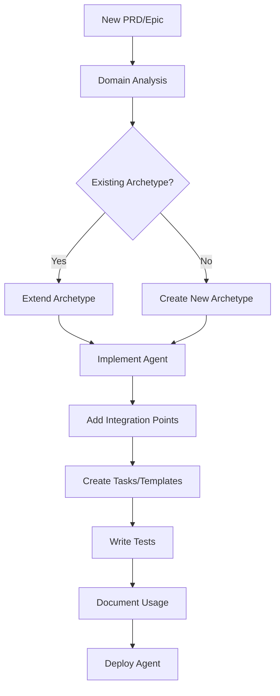

# BMad Framework Extension Guide

This guide covers extending the BMad framework for future PRDs and epics. The documentation is organized into the following sections:

## Documentation Structure

1. **[ACTIVATION_PATTERNS.md](./ACTIVATION_PATTERNS.md)** - Agent activation patterns and implementation
2. **[UTILIZATION_PATTERNS.md](./UTILIZATION_PATTERNS.md)** - Command execution and workflow patterns  
3. **[BASE_CLASSES.md](./BASE_CLASSES.md)** - Core classes, decorators, and utilities
4. **[INTEGRATION_PATTERNS.md](./INTEGRATION_PATTERNS.md)** - API, WebSocket, and security integration
5. **[DEVELOPMENT_TOOLKIT.md](./DEVELOPMENT_TOOLKIT.md)** - Tools for agent development and testing
6. **[EXTENSION_ARCHITECTURE.md](./EXTENSION_ARCHITECTURE.md)** - Plugin system and extension points
7. **[AGENT_ARCHETYPES.md](./AGENT_ARCHETYPES.md)** - Reusable agent patterns and templates
8. **[COMPOSITION_PATTERNS.md](./COMPOSITION_PATTERNS.md)** - Multi-agent orchestration and delegation

## Quick Start

To extend the framework for a new PRD/Epic:

1. **Identify the agent archetype** - See [AGENT_ARCHETYPES.md](./AGENT_ARCHETYPES.md)
2. **Create base implementation** - Use classes from [BASE_CLASSES.md](./BASE_CLASSES.md)
3. **Implement activation flow** - Follow [ACTIVATION_PATTERNS.md](./ACTIVATION_PATTERNS.md)
4. **Design command execution** - See [UTILIZATION_PATTERNS.md](./UTILIZATION_PATTERNS.md)
5. **Integrate with services** - Use [INTEGRATION_PATTERNS.md](./INTEGRATION_PATTERNS.md)
6. **Test thoroughly** - Tools in [DEVELOPMENT_TOOLKIT.md](./DEVELOPMENT_TOOLKIT.md)

## Framework Extension Workflow

## Core Extension Principles

1. **Reusability First** - Check existing archetypes before creating new ones
2. **Composition Over Inheritance** - Use mixins and composition patterns
3. **Clear Boundaries** - Maintain separation between agents
4. **Consistent Patterns** - Follow established BMad conventions
5. **Test Everything** - Comprehensive testing at all levels

## Version Compatibility

The framework maintains backward compatibility through:
- Semantic versioning for all components
- Deprecation warnings before breaking changes
- Migration utilities for version upgrades
- Feature flags for experimental features

## Getting Help

- Review example implementations in `bmad-framework/agents/`
- Check test cases in `bmad-framework/tests/`
- Use the development toolkit for scaffolding
- Follow patterns from successful implementations

---

For detailed information on any topic, see the respective documentation file.