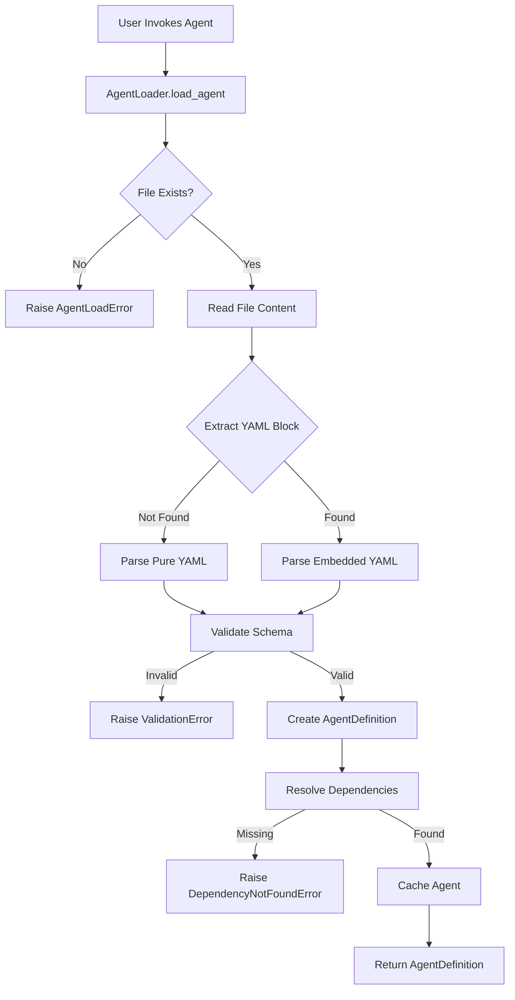
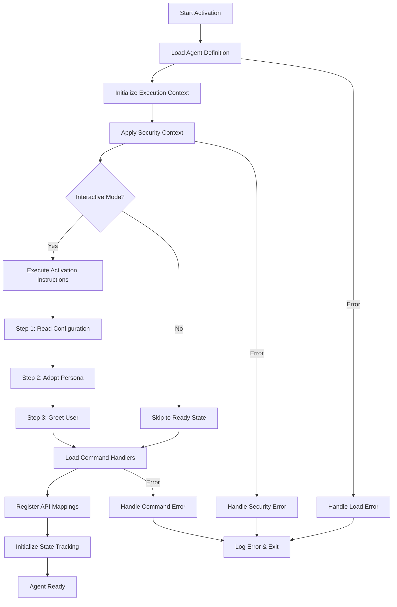

# 3. Agent Activation Phase

[← Previous: Agent Definition Phase](02-agent-definition-phase.md) | [Next: Agent Utilization Phase →](04-agent-utilization-phase.md)

---

## Loading Sequence

The agent activation follows this precise sequence:



### File Discovery Process

1. Check exact path: `agents/{agent_id}.md`
2. Check with extension: `agents/{agent_id}.yaml`
3. Check alternate formats: `agents/{agent_id}.yml`
4. Search recursively in agents directory
5. Raise `AgentLoadError` if not found

### YAML Parsing Steps

```python
# 1. Read file
content = Path(agent_path).read_text()

# 2. Check for embedded YAML
if "```yaml" in content:
    # Extract between markers
    yaml_content = extract_yaml_block(content)
else:
    # Pure YAML file
    yaml_content = content

# 3. Parse YAML
data = yaml.safe_load(yaml_content)

# 4. Validate structure
validate_agent_schema(data)
```

### Dependency Resolution Order

1. **Tasks**: Load from `tasks/` directory
2. **Templates**: Load from `templates/` directory
3. **Checklists**: Load from `checklists/` directory
4. **Data**: Load from `data/` directory
5. **Utils**: Import from `utils/` directory

Resolution algorithm:
```python
def resolve_dependency(dep_type: str, dep_name: str):
    search_paths = [
        f"bmad-framework/{dep_type}/{dep_name}",
        f".bmad-core/{dep_type}/{dep_name}",
        f"/{dep_type}/{dep_name}"
    ]
    for path in search_paths:
        if path.exists():
            return load_file(path)
    raise DependencyNotFoundError(dep_name)
```

### Memory Allocation

- Agent definitions cached after first load
- Cache key: `{agent_id}:{file_mtime}`
- Memory limit: 100 cached agents
- LRU eviction policy

## Activation Flowchart



## Persona Adoption Mechanics

### Identity Assumption

```python
class AgentPersona:
    def adopt(self, agent_def: AgentDefinition):
        # 1. Set communication style
        self.style = agent_def.persona.style
        
        # 2. Load expertise domains
        self.expertise = agent_def.persona.expertise
        
        # 3. Apply behavioral constraints
        self.constraints = agent_def.persona.constraints
        
        # 4. Initialize response patterns
        self.init_response_patterns()
```

### Context Switching

```python
class AgentContextManager:
    def switch_context(self, from_agent: str, to_agent: str):
        # 1. Save current state
        self.save_agent_state(from_agent)
        
        # 2. Clear active context
        self.clear_context()
        
        # 3. Load new agent
        new_agent = self.load_agent(to_agent)
        
        # 4. Restore relevant state
        self.restore_shared_state(new_agent)
```

### State Preservation

```python
class AgentState:
    def preserve(self):
        return {
            "conversation_history": self.history,
            "active_case": self.case_context,
            "command_stack": self.commands,
            "working_memory": self.memory
        }
    
    def restore(self, state: dict):
        self.history = state["conversation_history"]
        self.case_context = state["active_case"]
        # Selective restoration
```

## Activation Examples

### Standard Activation

```python
from bmad_framework import AgentLoader, AgentExecutor

# Load agent
loader = AgentLoader()
agent_def = await loader.load_agent("discovery-analyzer")

# Create execution context
executor = AgentExecutor()
context = await executor.create_context(
    agent_def=agent_def,
    case_name="Smith_v_Jones_2024"
)

# Activate agent
await executor.activate(context)
```

### Custom Activation

```python
# Custom activation with overrides
activation_config = {
    "skip_greeting": True,
    "api_mode": True,
    "security_level": "enhanced"
}

context = await executor.create_context(
    agent_def=agent_def,
    case_name="Smith_v_Jones_2024",
    activation_config=activation_config
)
```

### Debugging Activation Failures

```python
# Enable debug logging
import logging
logging.getLogger("bmad_framework").setLevel(logging.DEBUG)

try:
    agent_def = await loader.load_agent("my-agent")
except AgentLoadError as e:
    print(f"Load failed: {e}")
    print(f"Searched paths: {e.search_paths}")
    print(f"File exists: {e.file_exists}")
    
# Validate before activation
validation_errors = agent_def.validate()
if validation_errors:
    print("Validation errors:", validation_errors)
```

---

[← Previous: Agent Definition Phase](02-agent-definition-phase.md) | [Next: Agent Utilization Phase →](04-agent-utilization-phase.md)