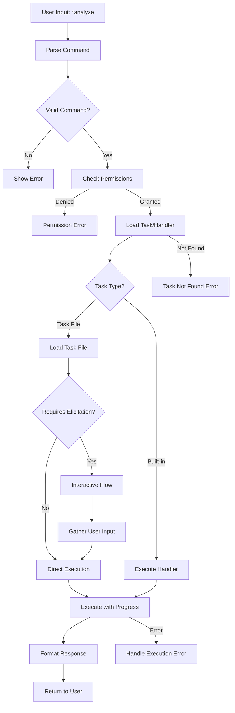

# 4. Agent Utilization Phase

[← Previous: Agent Activation Phase](03-agent-activation-phase.md) | [Next: Legal Agent Creation Walkthrough →](05-legal-agent-walkthrough.md)

---

## Command Execution Flow



## Command Parsing and Validation

```python
class CommandParser:
    def parse(self, user_input: str) -> ParsedCommand:
        # Remove * prefix
        if not user_input.startswith("*"):
            raise InvalidCommandError("Commands must start with *")
        
        parts = user_input[1:].split()
        command = parts[0]
        args = parts[1:] if len(parts) > 1 else []
        
        # Validate against agent commands
        if command not in self.agent_def.commands:
            # Try fuzzy matching
            match = self.fuzzy_match(command)
            if match:
                command = match
            else:
                raise CommandNotFoundError(command)
        
        return ParsedCommand(command=command, args=args)
```

## Task Routing Decision Tree

```python
def route_command(self, command: str) -> TaskRouter:
    # 1. Check built-in handlers
    if command in self.builtin_handlers:
        return BuiltinRouter(self.builtin_handlers[command])
    
    # 2. Check task dependencies
    task_name = f"{command}.md"
    if task_name in self.agent_def.dependencies.tasks:
        return TaskFileRouter(task_name)
    
    # 3. Check API mappings
    if command in self.api_mappings:
        return APIRouter(self.api_mappings[command])
    
    # 4. Default handler
    return DefaultRouter(self.handle_unknown)
```

## Dependency Loading

### Lazy Loading Implementation

```python
class DependencyLoader:
    def __init__(self):
        self._cache = {}
        
    async def load_task(self, task_name: str):
        if task_name in self._cache:
            return self._cache[task_name]
        
        # Load only when needed
        task_content = await self.read_task_file(task_name)
        parsed_task = self.parse_task(task_content)
        
        # Cache for session
        self._cache[task_name] = parsed_task
        return parsed_task
```

### Caching Strategy

- Session-based caching (cleared on agent switch)
- Dependency version tracking
- Memory limits (max 50 cached items)
- TTL for data files (5 minutes)

### Resource Cleanup

```python
class ResourceManager:
    async def cleanup(self):
        # 1. Clear dependency cache
        self._cache.clear()
        
        # 2. Close file handles
        for handle in self._open_files:
            handle.close()
        
        # 3. Clear temporary data
        self._temp_data.clear()
        
        # 4. Emit cleanup event
        await self.emit_event("agent:cleanup")
```

## State Management Guide

### Session State Tracking

```python
class SessionState:
    def __init__(self, agent_id: str, case_name: str):
        self.agent_id = agent_id
        self.case_name = case_name
        self.command_history = []
        self.context = {}
        self.start_time = datetime.now()
        
    def add_command(self, command: str, result: Any):
        self.command_history.append({
            "command": command,
            "timestamp": datetime.now(),
            "result": result,
            "context": self.context.copy()
        })
```

### Context Preservation

```python
class ContextPreserver:
    def save_context(self, session: SessionState):
        return {
            "agent_id": session.agent_id,
            "case_name": session.case_name,
            "history": session.command_history[-10:],  # Last 10
            "context": session.context,
            "duration": (datetime.now() - session.start_time).seconds
        }
    
    def restore_context(self, saved: dict) -> SessionState:
        session = SessionState(saved["agent_id"], saved["case_name"])
        session.command_history = saved["history"]
        session.context = saved["context"]
        return session
```

### Multi-turn Conversation

```python
class ConversationManager:
    def handle_multi_turn(self, command: str, session: SessionState):
        # 1. Check for context from previous turn
        if session.context.get("awaiting_input"):
            return self.handle_continuation(command, session)
        
        # 2. Check for follow-up patterns
        if self.is_follow_up(command):
            return self.handle_follow_up(command, session)
        
        # 3. New conversation turn
        return self.handle_new_turn(command, session)
```

## Utilization Examples

### Simple Command Execution

```python
# User: *help
result = await executor.execute_command(
    agent_def=agent_def,
    command="help",
    case_name="Smith_v_Jones_2024"
)
# Returns formatted help text
```

### Complex Multi-Task Workflow

```python
# Define workflow
workflow = [
    {"command": "analyze", "params": {"rtp_id": "123"}},
    {"command": "search", "params": {"query": "email"}},
    {"command": "categorize", "params": {"threshold": 0.8}},
    {"command": "report", "params": {"format": "detailed"}}
]

# Execute workflow
results = []
for step in workflow:
    result = await executor.execute_command(
        agent_def=agent_def,
        command=step["command"],
        case_name="Smith_v_Jones_2024",
        parameters=step["params"]
    )
    results.append(result)
    
    # Check for errors
    if result.status == "failed":
        break
```

### Error Recovery

```python
async def execute_with_recovery(executor, command, retries=3):
    for attempt in range(retries):
        try:
            return await executor.execute_command(
                agent_def=agent_def,
                command=command,
                case_name="Smith_v_Jones_2024"
            )
        except TaskExecutionError as e:
            if attempt == retries - 1:
                raise
            
            # Try recovery
            if e.recoverable:
                await asyncio.sleep(2 ** attempt)  # Exponential backoff
                continue
            else:
                raise
```

---

[← Previous: Agent Activation Phase](03-agent-activation-phase.md) | [Next: Legal Agent Creation Walkthrough →](05-legal-agent-walkthrough.md)