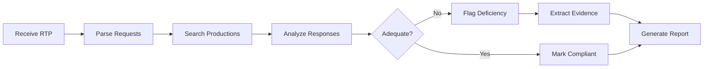

# 5. Legal Agent Creation Walkthrough

[← Previous: Agent Utilization Phase](04-agent-utilization-phase.md) | [Next: BMad Best Practices →](06-best-practices.md)

---

## Planning Guide for Legal Agents

### Identifying Purpose and Scope

1. **Define Core Function**
   - What legal task does this agent perform?
   - What are the inputs and outputs?
   - What expertise is required?

2. **Scope Boundaries**
   - What is explicitly included?
   - What is explicitly excluded?
   - What are the edge cases?

3. **Success Criteria**
   - How is success measured?
   - What are quality metrics?
   - What are performance targets?

Example Planning:
```markdown
Agent: Discovery Deficiency Analyzer
Purpose: Identify missing or inadequate discovery responses
Inputs: RTP document, Production documents, OC responses
Outputs: Deficiency report with evidence
Scope: Federal and Florida discovery rules
Exclusions: Privilege log analysis (separate agent)
Success: 95% accuracy in deficiency identification
```

### Mapping Legal Workflows



Map to commands:
- `*analyze` - Full workflow execution
- `*parse` - Parse RTP only
- `*search` - Search specific requests
- `*evidence` - Extract evidence chunks
- `*report` - Generate final report

### Compliance Requirements

```yaml
compliance:
  data_isolation: true
  audit_logging: true
  encryption: at_rest
  retention: 7_years
  jurisdiction:
    - federal
    - florida
  certifications:
    - ISO_27001
    - SOC2
```

### Performance Considerations

```yaml
performance:
  max_document_size: 100MB
  timeout: 300s
  concurrent_tasks: 5
  memory_limit: 2GB
  optimization:
    - Chunk processing for large documents
    - Caching for repeated searches
    - Async I/O for file operations
```

## Step-by-Step YAML Creation

### Starting from Template

```bash
# 1. Copy template
cp bmad-framework/templates/agent-tmpl.yaml \
   bmad-framework/agents/discovery-analyzer.yaml

# 2. Edit with legal specifics
```

### Customizing for Legal Domain

```yaml
# Original template
agent:
  name: Agent Name
  id: agent-id

# Legal customization
agent:
  name: Discovery Deficiency Analyzer
  id: discovery-analyzer
  title: Senior Discovery Compliance Specialist
  icon: ⚖️
  whenToUse: Analyzing discovery productions for compliance
  customization: "Federal and Florida rules focus"
  tags: ["legal", "discovery", "compliance", "analysis"]
```

### Adding Legal Commands

```yaml
commands:
  # Core analysis commands
  - analyze:
      description: Complete deficiency analysis
      required_inputs: ["rtp_id", "production_id"]
      
  - parse-rtp:
      description: Parse RTP document only
      required_inputs: ["rtp_id"]
      
  # Search commands
  - search-production:
      description: Search within production documents
      parameters:
        query: string
        filters: object
        
  - find-responsive:
      description: Find responsive documents for request
      parameters:
        request_number: string
        
  # Reporting commands
  - generate-report:
      description: Create deficiency report
      formats: ["summary", "detailed", "legal"]
      
  - export-evidence:
      description: Export evidence with citations
      formats: ["pdf", "excel", "json"]
```

### Case Management Integration

```yaml
integration:
  case_management:
    - validate_case_access: true
    - track_usage: true
    - audit_trail: true
    
  services:
    - case_manager: CaseManager
    - vector_store: QdrantVectorStore
    - rtp_parser: RTPParser
    - pdf_processor: PDFExtractor
```

## Legal Task Development

### Task Structure

```markdown
# analyze-deficiencies

## Purpose
Perform comprehensive deficiency analysis comparing RTP requests against discovery productions and opposing counsel responses.

## Task Execution

### Step 1: Validate Inputs
- Verify case access permissions
- Check RTP document exists
- Confirm production documents loaded
- Validate OC response document

### Step 2: Parse RTP Document
```python
rtp_parser = RTPParser()
requests = await rtp_parser.extract_requests(rtp_id)
await emit_progress("Parsed {len(requests)} requests", step=1, total=5)
```

### Step 3: Analyze Each Request
```python
for i, request in enumerate(requests):
    # Search production
    responsive_docs = await search_production(
        case_name=case_name,
        request=request
    )
    
    # Check OC response
    oc_claim = await extract_oc_response(request.number)
    
    # Determine compliance
    compliance = await categorize_compliance(
        request=request,
        responsive_docs=responsive_docs,
        oc_claim=oc_claim
    )
    
    await emit_progress(
        f"Analyzed request {request.number}",
        step=2 + (i/len(requests)),
        total=5
    )
```

### Step 4: Extract Evidence
```python
evidence_chunks = await extract_supporting_evidence(
    deficiencies=identified_deficiencies,
    production_docs=responsive_docs
)
```

### Step 5: Generate Report
```python
report = await generate_deficiency_report(
    requests=requests,
    deficiencies=identified_deficiencies,
    evidence=evidence_chunks
)
```

## Elicitation Required
elicit: false

## WebSocket Events
- discovery:analysis_started
- discovery:request_analyzed
- discovery:deficiency_found
- discovery:analysis_completed

## Error Handling
- Missing documents: Partial analysis with warnings
- Parse failures: Skip request with error log
- Search timeout: Retry with smaller batch
```

### Integration Points

```python
# RTPParser Integration
from services.rtp_parser import RTPParser

async def parse_rtp_document(rtp_id: str, case_name: str):
    parser = RTPParser()
    requests = await parser.extract_requests(
        document_id=rtp_id,
        case_name=case_name
    )
    return requests

# Qdrant Integration  
from vector_storage.qdrant_store import QdrantVectorStore

async def search_production(case_name: str, query: str):
    store = QdrantVectorStore()
    results = await store.hybrid_search(
        case_name=case_name,
        query_text=query,
        limit=50,
        vector_weight=0.7
    )
    return results
```

### Progress Tracking

```python
from bmad_framework.websocket_progress import ProgressTracker

async def analyze_with_progress(case_id: str, rtp_id: str):
    async with ProgressTracker(
        case_id=case_id,
        agent_id="discovery-analyzer",
        task_name="analyze-deficiencies",
        total_steps=5
    ) as tracker:
        # Step 1
        await tracker.emit_progress("Validating inputs...")
        
        # Step 2
        await tracker.emit_progress("Parsing RTP document...")
        
        # Continue...
```

### Error Handling

```python
class DeficiencyAnalysisError(TaskExecutionError):
    """Base error for deficiency analysis."""
    pass

class InvalidRTPError(DeficiencyAnalysisError):
    """RTP document is invalid or corrupted."""
    pass

class ProductionNotFoundError(DeficiencyAnalysisError):
    """Production documents not found."""
    pass

# In task
try:
    requests = await parse_rtp_document(rtp_id)
except Exception as e:
    raise InvalidRTPError(f"Failed to parse RTP: {e}")
```

## Template Creation

### Legal Document Template Format

```yaml
metadata:
  type: legal_report
  subtype: deficiency_analysis
  version: "1.0"
  jurisdiction: 
    - federal
    - florida
  compliance:
    - FRCP_26
    - FRCP_34
    - FLA_CIV_P_1.350

structure:
  - section: caption
    required: true
    template: |
      [COURT_NAME]
      [JURISDICTION]
      
      [PLAINTIFF_NAME],
              Plaintiff,
      v.                                   Case No. [CASE_NUMBER]
      [DEFENDANT_NAME],
              Defendant.
      
      DEFICIENCY ANALYSIS REPORT
      [REPORT_DATE]
    
  - section: executive_summary
    required: true
    template: |
      ## Executive Summary
      
      This report analyzes [PARTY_NAME]'s production in response to 
      [REQUESTING_PARTY]'s [REQUEST_TYPE] dated [REQUEST_DATE].
      
      Total Requests Analyzed: [TOTAL_REQUESTS]
      Fully Compliant: [COMPLIANT_COUNT]
      Partially Compliant: [PARTIAL_COUNT]
      Non-Compliant: [DEFICIENT_COUNT]
      
  - section: detailed_analysis
    required: true
    repeatable: true
    for_each: deficiency
    template: |
      ### Request No. [REQUEST_NUMBER]
      
      **Request Text:**
      [REQUEST_TEXT]
      
      **Opposing Counsel Response:**
      [OC_RESPONSE]
      
      **Deficiency Type:** [DEFICIENCY_TYPE]
      
      **Analysis:**
      [DETAILED_ANALYSIS]
      
      **Supporting Evidence:**
      [EVIDENCE_CHUNKS]
      
      **Recommended Action:**
      [RECOMMENDATION]

variables:
  COURT_NAME:
    type: string
    source: case.court_name
    required: true
    
  CASE_NUMBER:
    type: string
    source: case.number
    required: true
    
  TOTAL_REQUESTS:
    type: integer
    source: analysis.total_requests
    computed: true
    
  DEFICIENCY_TYPE:
    type: enum
    values:
      - No responsive documents produced
      - Incomplete production
      - Improper objection
      - Missing privilege log
      - Format non-compliance

validation_rules:
  - rule: case_parties_complete
    check: PLAINTIFF_NAME != null && DEFENDANT_NAME != null
    message: Case parties must be specified
    
  - rule: minimum_analysis
    check: len(deficiencies) > 0 || COMPLIANT_COUNT == TOTAL_REQUESTS
    message: Analysis must evaluate all requests

formatting:
  date_format: "MMMM d, yyyy"
  number_format: "#,##0"
  
conditional_sections:
  - condition: deficiencies.length > 10
    add_section: summary_table
    
  - condition: case.jurisdiction == "federal"
    add_section: federal_rules_appendix
```

### Variable Substitution

```python
class TemplateEngine:
    async def render(self, template: dict, context: dict) -> str:
        # Load template structure
        content = []
        
        for section in template["structure"]:
            if section.get("required") or self.evaluate_condition(section):
                if section.get("repeatable"):
                    # Render for each item
                    for item in context[section["for_each"]]:
                        rendered = self.substitute_variables(
                            section["template"],
                            {**context, **item}
                        )
                        content.append(rendered)
                else:
                    # Render once
                    rendered = self.substitute_variables(
                        section["template"],
                        context
                    )
                    content.append(rendered)
        
        return "\n\n".join(content)
```

### Jurisdiction Variations

```yaml
# Federal template
templates/deficiency-report-federal.yaml:
  metadata:
    jurisdiction: federal
    rules:
      - FRCP_26
      - FRCP_34
      
# State template  
templates/deficiency-report-florida.yaml:
  metadata:
    jurisdiction: florida
    rules:
      - FLA_CIV_P_1.350
      - FLA_CIV_P_1.380
```

### Version Control

```yaml
versioning:
  current: "2.1.0"
  history:
    - version: "2.1.0"
      date: "2024-01-15"
      changes:
        - Added AI confidence scores
        - Enhanced evidence citation format
        
    - version: "2.0.0"
      date: "2023-12-01"
      changes:
        - Major format revision
        - Added conditional sections
        
    - version: "1.0.0"
      date: "2023-10-01"
      changes:
        - Initial template
```

---

[← Previous: Agent Utilization Phase](04-agent-utilization-phase.md) | [Next: BMad Best Practices →](06-best-practices.md)