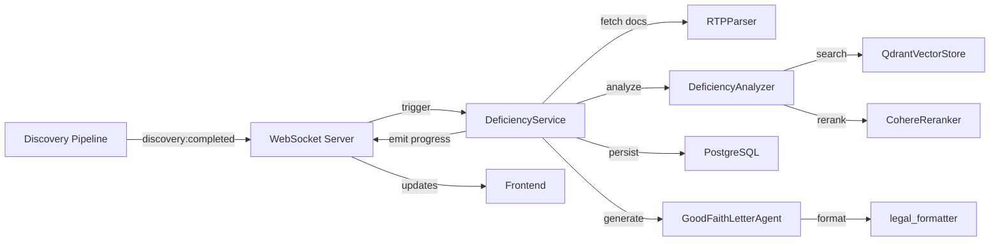

# Clerk Legal AI System - Discovery Deficiency Analysis Architecture

## Introduction

This document outlines the architectural approach for enhancing **Clerk Legal AI System** with Discovery Deficiency Analysis capabilities. Its primary goal is to serve as the guiding architectural blueprint for AI-driven development of new features while ensuring seamless integration with the existing system.

**Relationship to Existing Architecture:**
This document supplements existing project architecture by defining how new components will integrate with current systems. Where conflicts arise between new and existing patterns, this document provides guidance on maintaining consistency while implementing enhancements.

## Existing Project Analysis

**Current Project State:**
- **Primary Purpose:** Legal AI system for motion drafting and document management for law firms
- **Current Tech Stack:** FastAPI (Python 3.11+), Qdrant, PostgreSQL, OpenAI, Box API, n8n, Docker Compose, React 19/Vite frontend, Caddy
- **Architecture Style:** Vertical slice architecture with domain-driven design, comprehensive AI agent system
- **Deployment Method:** Docker Compose with multi-service orchestration (PostgreSQL, n8n, Clerk, Qdrant, Caddy)

**Available Documentation:**
- CLAUDE.md (project-specific AI coding guidelines and principles)
- Discovery Deficiency Analysis PRD (docs/prd.md)

**Identified Constraints:**
- Must maintain compatibility with existing n8n workflows
- Database isolation requirement for multi-tenancy (separate Qdrant DBs per case)
- Docker Compose orchestration with specific service dependencies
- Strict vertical slice architecture must be maintained
- Python 3.11+ with type safety requirements
- Caddy for HTTPS/TLS management in production

## Change Log
| Change | Date | Version | Description | Author |
|--------|------|---------|-------------|--------|
| Initial Creation | 2025-01-18 | 1.0 | Created brownfield architecture for Discovery Deficiency Analysis | Winston |

## Enhancement Scope and Integration Strategy

### Enhancement Overview
- **Enhancement Type:** New Feature Addition
- **Scope:** Extend discovery processing pipeline with intelligent deficiency analysis
- **Integration Impact:** Significant - requires integration with existing discovery pipeline, WebSocket events, and frontend components

### Integration Approach
- **Code Integration Strategy:** Extend existing discovery processing pipeline by hooking into the fact extraction completion event. New components will follow the vertical slice architecture pattern.
- **Database Integration:** Leverage existing PostgreSQL database with new tables for deficiency analysis results. Maintain case isolation through case_name filtering.
- **API Integration:** Add new FastAPI endpoints following existing RESTful patterns. Extend WebSocket events with deficiency-specific namespacing.
- **UI Integration:** Enhance existing discovery upload interface and add new report review components using the existing React component library.

### Compatibility Requirements
- **Existing API Compatibility:** All existing discovery endpoints remain unchanged. New endpoints follow /api/deficiency/* pattern.
- **Database Schema Compatibility:** Additive changes only - new tables without modifying existing structures
- **UI/UX Consistency:** Reuse existing design tokens, components, and interaction patterns
- **Performance Impact:** Asynchronous processing ensures no impact on existing discovery pipeline performance

## Tech Stack Alignment

### Existing Technology Stack

| Category | Current Technology | Version | Usage in Enhancement | Notes |
|----------|-------------------|---------|---------------------|-------|
| Language | Python | 3.11+ | Primary development language | Type hints required |
| Framework | FastAPI | Latest | API endpoints and async processing | RESTful patterns |
| Database | PostgreSQL | 15+ | Deficiency report storage | Via docker-compose |
| Vector DB | Qdrant | Latest | Discovery document search | Case-isolated DBs |
| AI/ML | OpenAI GPT | 3.5/4 | Document analysis and comparison | Cost tracked |
| AI/ML | Cohere | v3.5 | Reranking for deficiency search | Existing integration |
| WebSocket | Socket.io | Latest | Real-time progress updates | Event namespacing |
| Frontend | React | 19 | UI components and forms | With Vite bundler |
| Styling | Tailwind CSS | Latest | Component styling | Design tokens |
| PDF Processing | pdfplumber/PyPDF2 | Latest | RTP/OC response parsing | Existing libraries |
| Infrastructure | Docker Compose | Latest | Service orchestration | Multi-container |
| Proxy/TLS | Caddy | Latest | HTTPS and routing | Production only |
| Testing | pytest | Latest | Unit and integration tests | Co-located tests |

### New Technology Additions

No new technologies are required for this enhancement. All functionality will be built using the existing technology stack to maintain consistency and reduce operational complexity.

## Data Models and Schema Changes

### New Data Models

**DeficiencyReport**
- **Purpose:** Root model for storing complete deficiency analysis results
- **Integration:** Links to discovery production and case records

**Key Attributes:**
- id: UUID - Unique identifier
- case_name: str - Case identifier for isolation
- production_id: UUID - Links to discovery production
- rtp_document_id: UUID - Reference to uploaded RTP document
- oc_response_document_id: UUID - Reference to OC response document
- analysis_status: str - pending|processing|completed|failed
- created_at: datetime - Analysis start time
- completed_at: datetime - Analysis completion time
- total_requests: int - Number of RTP items analyzed
- summary_statistics: JSON - Breakdown by category

**Relationships:**
- **With Existing:** Links to discovery_productions table via production_id
- **With New:** One-to-many with DeficiencyItem records

**DeficiencyItem**
- **Purpose:** Individual RTP request analysis result
- **Integration:** Child of DeficiencyReport, references vector search results

**Key Attributes:**
- id: UUID - Unique identifier
- report_id: UUID - Parent DeficiencyReport reference
- request_number: str - RTP item number (e.g., "RFP No. 12")
- request_text: str - Full text of the RTP request
- oc_response_text: str - Opposing counsel's response
- classification: str - fully_produced|partially_produced|not_produced|no_responsive_docs
- confidence_score: float - AI confidence in classification (0-1)
- evidence_chunks: JSON - Array of matched document chunks with metadata
- reviewer_notes: str - Legal team annotations
- modified_by: str - User who made changes
- modified_at: datetime - Last modification time

**Relationships:**
- **With Existing:** References document chunks via evidence_chunks JSON
- **With New:** Many-to-one with DeficiencyReport

**GoodFaithLetter**
- **Purpose:** Generated letter drafts with version tracking
- **Integration:** Links to DeficiencyReport for source data

**Key Attributes:**
- id: UUID - Unique identifier
- report_id: UUID - Source DeficiencyReport
- template_name: str - Template used for generation
- version: int - Draft version number
- content: str - Letter content in markdown
- metadata: JSON - Jurisdiction, deadlines, etc.
- created_by: str - User who generated
- created_at: datetime - Generation timestamp

**Relationships:**
- **With Existing:** Uses case_name for access control
- **With New:** Many-to-one with DeficiencyReport

### Schema Integration Strategy

**Database Changes Required:**
- **New Tables:** deficiency_reports, deficiency_items, good_faith_letters
- **Modified Tables:** discovery_productions (add has_deficiency_analysis boolean)
- **New Indexes:** case_name + created_at for reports, report_id + request_number for items
- **Migration Strategy:** Alembic migration with zero downtime deployment

**Backward Compatibility:**
- All changes are additive - no existing columns modified
- Discovery pipeline continues to function without deficiency analysis
- Feature flag controls whether analysis is triggered

## Component Architecture

### New Components

**DeficiencyAnalyzer**
- **Responsibility:** AI agent that analyzes RTP requests against discovery productions
- **Integration Points:** 
  - Receives trigger from fact extraction completion
  - Queries Qdrant vector store for document matching
  - Outputs classifications to DeficiencyService

**Key Interfaces:**
- `analyze_rtp_item(request: RTPRequest, case_name: str) -> DeficiencyClassification`
- `search_production_documents(query: str, case_name: str, production_id: str) -> List[DocumentChunk]`

**Dependencies:**
- **Existing Components:** QdrantVectorStore, EmbeddingGenerator, CohereReranker
- **New Components:** RTPParser, DeficiencyService

**Technology Stack:** Python, OpenAI GPT-4, Qdrant hybrid search

**RTPParser**
- **Responsibility:** Extract and parse RTP requests from uploaded PDF documents
- **Integration Points:**
  - Receives PDF file path from discovery processing
  - Outputs structured RTP items to DeficiencyAnalyzer

**Key Interfaces:**
- `parse_rtp_document(pdf_path: str) -> List[RTPRequest]`
- `extract_request_number(text: str) -> str`

**Dependencies:**
- **Existing Components:** pdf_extractor, enhanced_chunker
- **New Components:** None

**Technology Stack:** Python, pdfplumber, regex parsing

**DeficiencyService**
- **Responsibility:** Orchestrates the complete deficiency analysis workflow
- **Integration Points:**
  - Listens for discovery:completed WebSocket events
  - Coordinates analysis across all components
  - Persists results to PostgreSQL

**Key Interfaces:**
- `process_deficiency_analysis(production_id: str, case_name: str) -> DeficiencyReport`
- `update_analysis_status(report_id: str, status: str) -> None`

**Dependencies:**
- **Existing Components:** WebSocket server, PostgreSQL connection
- **New Components:** DeficiencyAnalyzer, RTPParser, GoodFaithLetterAgent

**Technology Stack:** Python, FastAPI, asyncio, SQLAlchemy

**GoodFaithLetterAgent**
- **Responsibility:** Generate professional Good Faith letters from deficiency reports
- **Integration Points:**
  - Reads DeficiencyReport from database
  - Uses templates for letter generation
  - Outputs formatted letters

**Key Interfaces:**
- `generate_letter(report_id: str, template_name: str) -> GoodFaithLetter`
- `customize_letter(letter_id: str, modifications: Dict) -> GoodFaithLetter`

**Dependencies:**
- **Existing Components:** legal_formatter
- **New Components:** DeficiencyService

**Technology Stack:** Python, OpenAI GPT-4, Jinja2 templates

### Component Interaction Diagram



## API Design and Integration

### API Integration Strategy
- **API Integration Strategy:** Extend existing discovery API with deficiency-specific endpoints
- **Authentication:** Reuse existing JWT authentication via case context middleware
- **Versioning:** No versioning needed - additive changes only

### New API Endpoints

**POST /api/discovery/process-with-deficiency**
- **Method:** POST
- **Endpoint:** /api/discovery/process-with-deficiency
- **Purpose:** Enhanced discovery processing that includes deficiency analysis
- **Integration:** Extends existing /process-folder endpoint with additional file uploads

**Request:**
```json
{
  "folder_id": "123456789",
  "case_name": "smith_v_jones_2024", 
  "max_documents": 100,
  "rtp_file": "base64_encoded_pdf",
  "oc_response_file": "base64_encoded_pdf",
  "enable_deficiency_analysis": true
}
```

**Response:**
```json
{
  "production_id": "uuid-here",
  "status": "processing",
  "message": "Discovery processing started with deficiency analysis",
  "websocket_channel": "discovery:uuid-here"
}
```

**GET /api/deficiency/report/{report_id}**
- **Method:** GET
- **Endpoint:** /api/deficiency/report/{report_id}
- **Purpose:** Retrieve complete deficiency analysis report
- **Integration:** Uses case context middleware for access control

**Request:** None (report_id in path)

**Response:**
```json
{
  "id": "uuid-here",
  "case_name": "smith_v_jones_2024",
  "production_id": "uuid-here",
  "analysis_status": "completed",
  "total_requests": 25,
  "summary_statistics": {
    "fully_produced": 10,
    "partially_produced": 8,
    "not_produced": 5,
    "no_responsive_docs": 2
  },
  "items": [
    {
      "request_number": "RFP No. 1",
      "request_text": "All medical records...",
      "classification": "fully_produced",
      "confidence_score": 0.92,
      "evidence_chunks": [...]
    }
  ]
}
```

**PUT /api/deficiency/item/{item_id}**
- **Method:** PUT
- **Endpoint:** /api/deficiency/item/{item_id}
- **Purpose:** Update deficiency item classification or add reviewer notes
- **Integration:** Tracks user modifications for audit trail

**Request:**
```json
{
  "classification": "partially_produced",
  "reviewer_notes": "Missing records from January 2023"
}
```

**Response:**
```json
{
  "id": "uuid-here",
  "classification": "partially_produced",
  "reviewer_notes": "Missing records from January 2023",
  "modified_by": "attorney@firm.com",
  "modified_at": "2024-01-18T10:30:00Z"
}
```

**POST /api/deficiency/letter/generate**
- **Method:** POST
- **Endpoint:** /api/deficiency/letter/generate
- **Purpose:** Generate Good Faith letter from deficiency report
- **Integration:** Uses approved templates and legal formatting

**Request:**
```json
{
  "report_id": "uuid-here",
  "template_name": "florida_10_day_standard",
  "custom_deadline": "2024-01-28"
}
```

**Response:**
```json
{
  "id": "uuid-here",
  "report_id": "uuid-here",
  "version": 1,
  "content": "# Good Faith Letter\n\n...",
  "created_at": "2024-01-18T11:00:00Z",
  "export_url": "/api/deficiency/letter/uuid-here/export"
}
```

### WebSocket Events

**deficiency:analysis_started**
```json
{
  "production_id": "uuid-here",
  "total_requests": 25,
  "timestamp": "2024-01-18T10:00:00Z"
}
```

**deficiency:item_analyzed**
```json
{
  "production_id": "uuid-here",
  "request_number": "RFP No. 12",
  "classification": "not_produced",
  "progress": "12/25",
  "timestamp": "2024-01-18T10:05:00Z"
}
```

**deficiency:analysis_completed**
```json
{
  "production_id": "uuid-here",
  "report_id": "uuid-here",
  "duration_seconds": 300,
  "timestamp": "2024-01-18T10:10:00Z"
}
```

## Source Tree Integration

### Existing Project Structure
```plaintext
Clerk/
├── src/
│   ├── ai_agents/           # AI agent modules
│   ├── api/                 # API endpoints
│   ├── models/              # Data models
│   ├── services/            # Business logic
│   ├── document_processing/ # PDF processing
│   ├── vector_storage/      # Qdrant integration
│   └── websocket/           # Real-time updates
├── frontend/
│   ├── src/
│   │   ├── components/      # React components
│   │   ├── services/        # API clients
│   │   └── hooks/           # Custom hooks
└── tests/                   # Integration tests
```

### New File Organization
```plaintext
Clerk/
├── src/
│   ├── ai_agents/
│   │   ├── deficiency_analyzer.py         # NEW: Deficiency analysis agent
│   │   ├── good_faith_letter_agent.py     # NEW: Letter generation agent
│   │   └── tests/
│   │       ├── test_deficiency_analyzer.py
│   │       └── test_good_faith_letter_agent.py
│   │
│   ├── api/
│   │   ├── deficiency_endpoints.py        # NEW: Deficiency API routes
│   │   └── tests/
│   │       └── test_deficiency_endpoints.py
│   │
│   ├── models/
│   │   ├── deficiency_models.py           # NEW: Pydantic models
│   │   └── tests/
│   │       └── test_deficiency_models.py
│   │
│   ├── services/
│   │   ├── deficiency_service.py          # NEW: Orchestration service
│   │   └── tests/
│   │       └── test_deficiency_service.py
│   │
│   ├── document_processing/
│   │   ├── rtp_parser.py                  # NEW: RTP document parser
│   │   └── tests/
│   │       └── test_rtp_parser.py
│   │
│   └── migrations/
│       └── versions/
│           └── 004_add_deficiency_tables.py # NEW: DB migration
│
├── frontend/
│   └── src/
│       ├── components/
│       │   └── deficiency/                # NEW: Deficiency UI components
│       │       ├── DeficiencyReport.tsx
│       │       ├── DeficiencyItemEditor.tsx
│       │       ├── GoodFaithLetterPreview.tsx
│       │       └── __tests__/
│       │
│       ├── services/
│       │   └── api/
│       │       └── deficiencyService.ts   # NEW: Deficiency API client
│       │
│       └── hooks/
│           └── useDeficiencyAnalysis.ts   # NEW: Deficiency hooks
│
└── templates/
    └── good_faith_letters/                # NEW: Letter templates
        ├── florida_10_day_standard.jinja2
        └── texas_30_day_standard.jinja2
```

### Integration Guidelines
- **File Naming:** Follow snake_case for Python, PascalCase for React components
- **Folder Organization:** New files placed in existing module structure
- **Import/Export Patterns:** Use existing __init__.py patterns for module exports

## Infrastructure and Deployment Integration

### Existing Infrastructure
- **Current Deployment:** Docker Compose multi-service stack
- **Infrastructure Tools:** Docker, Docker Compose, Caddy (reverse proxy)
- **Environments:** Development (local), Production (with Caddy HTTPS)

### Enhancement Deployment Strategy
- **Deployment Approach:** Zero-downtime deployment with feature flag control
- **Infrastructure Changes:** None - uses existing PostgreSQL and service architecture
- **Pipeline Integration:** Add deficiency analysis as optional step in discovery processing

### Rollback Strategy
- **Rollback Method:** Feature flag disable (ENABLE_DEFICIENCY_ANALYSIS=false)
- **Risk Mitigation:** Deficiency analysis runs async - discovery pipeline continues if it fails
- **Monitoring:** Extended cost tracking and performance metrics for deficiency operations

### Docker Configuration Updates

**docker-compose.clerk.yml additions:**
```yaml
services:
  clerk:
    environment:
      # Existing environment variables...
      - ENABLE_DEFICIENCY_ANALYSIS=${ENABLE_DEFICIENCY_ANALYSIS:-false}
      - DEFICIENCY_CONFIDENCE_THRESHOLD=${DEFICIENCY_CONFIDENCE_THRESHOLD:-0.7}
      - DEFICIENCY_MAX_ANALYSIS_TIME=${DEFICIENCY_MAX_ANALYSIS_TIME:-600}
```

**Environment Variables:**
```bash
# Feature Control
ENABLE_DEFICIENCY_ANALYSIS=true

# Analysis Configuration  
DEFICIENCY_CONFIDENCE_THRESHOLD=0.7
DEFICIENCY_MAX_ANALYSIS_TIME=600
DEFICIENCY_MAX_EVIDENCE_CHUNKS=5

# Template Configuration
GOOD_FAITH_LETTER_TEMPLATE_PATH=/app/templates/good_faith_letters
```

**Deployment Steps:**
1. Deploy database migrations (backward compatible)
2. Deploy backend with feature flag disabled
3. Deploy frontend components
4. Enable feature flag for testing
5. Gradual rollout to production

## Coding Standards and Conventions

### Existing Standards Compliance
- **Code Style:** PEP8 with type hints, formatted with ruff
- **Linting Rules:** ruff check . (configured in project)
- **Testing Patterns:** pytest with co-located tests in tests/ subdirectories
- **Documentation Style:** Google-style docstrings for all functions

### Critical Integration Rules
- **Existing API Compatibility:** Never modify existing discovery endpoints - only extend
- **Database Integration:** Always use case_name for filtering - no cross-case queries
- **Error Handling:** Use existing exception patterns with detailed logging
- **Logging Consistency:** Use logger = logging.getLogger("clerk_api") pattern

### Code Examples Following Standards

**Python Code Pattern:**
```python
from typing import List, Optional
from pydantic import BaseModel
from src.utils.logger import get_logger

logger = get_logger("clerk_api")

class DeficiencyAnalyzer:
    """
    AI agent for analyzing RTP requests against discovery productions.
    
    Attributes:
        case_name (str): Case identifier for isolation.
        confidence_threshold (float): Minimum confidence for classifications.
    """
    
    async def analyze_rtp_item(
        self, 
        request: RTPRequest, 
        case_name: str
    ) -> DeficiencyClassification:
        """
        Analyze a single RTP request against production documents.
        
        Args:
            request (RTPRequest): The RTP request to analyze.
            case_name (str): Case name for document isolation.
            
        Returns:
            DeficiencyClassification: Analysis result with evidence.
            
        Raises:
            AnalysisTimeoutError: If analysis exceeds time limit.
        """
        # Implementation follows KISS principle
        pass
```

**React/TypeScript Pattern:**
```typescript
import { useState, useEffect } from 'react';
import { useWebSocket } from '@/hooks/useWebSocket';
import { DeficiencyReport } from '@/types/deficiency.types';

export const DeficiencyReportView: React.FC<{ reportId: string }> = ({ reportId }) => {
  const [report, setReport] = useState<DeficiencyReport | null>(null);
  const { emit, on } = useWebSocket();
  
  useEffect(() => {
    // Follow existing WebSocket patterns
    const handleUpdate = (data: DeficiencyReport) => {
      setReport(data);
    };
    
    on('deficiency:report_updated', handleUpdate);
    return () => off('deficiency:report_updated', handleUpdate);
  }, [reportId]);
  
  // Component implementation
};
```

**Testing Pattern:**
```python
import pytest
from unittest.mock import Mock, patch
from src.ai_agents.deficiency_analyzer import DeficiencyAnalyzer

class TestDeficiencyAnalyzer:
    """Test suite for DeficiencyAnalyzer following existing patterns."""
    
    @pytest.fixture
    def analyzer(self):
        """Create analyzer instance for testing."""
        return DeficiencyAnalyzer(
            case_name="test_case",
            confidence_threshold=0.7
        )
    
    async def test_analyze_rtp_item_success(self, analyzer):
        """Test successful RTP item analysis."""
        # Arrange
        request = RTPRequest(
            number="RFP No. 1",
            text="All medical records"
        )
        
        # Act
        result = await analyzer.analyze_rtp_item(request, "test_case")
        
        # Assert
        assert result.classification in ["fully_produced", "partially_produced", "not_produced", "no_responsive_docs"]
        assert 0 <= result.confidence_score <= 1
```

## Testing Strategy

### Integration with Existing Tests
- **Existing Test Framework:** pytest with asyncio support
- **Test Organization:** Co-located tests in tests/ subdirectories
- **Coverage Requirements:** Maintain >80% coverage for new code

### New Testing Requirements

**Unit Tests for New Components:**
- **Framework:** pytest
- **Location:** src/*/tests/ following vertical slice pattern
- **Coverage Target:** 85% for critical paths
- **Integration with Existing:** Use existing fixtures and mocks

**Integration Tests:**
- **Scope:** End-to-end deficiency analysis workflow
- **Existing System Verification:** Ensure discovery pipeline unaffected
- **New Feature Testing:** Complete deficiency analysis with mock data

**Regression Testing:**
- **Existing Feature Verification:** Run full discovery test suite
- **Automated Regression Suite:** Add deficiency tests to CI/CD
- **Manual Testing Requirements:** Legal team UAT for report accuracy

### Test Implementation Examples

**Integration Test Pattern:**
```python
import pytest
from httpx import AsyncClient
from src.main import app

class TestDeficiencyIntegration:
    """Integration tests for deficiency analysis workflow."""
    
    @pytest.mark.asyncio
    async def test_complete_deficiency_workflow(self, async_client: AsyncClient):
        """Test full workflow from discovery to letter generation."""
        # Step 1: Process discovery with deficiency analysis
        response = await async_client.post(
            "/api/discovery/process-with-deficiency",
            json={
                "folder_id": "test_folder",
                "case_name": "test_case",
                "rtp_file": "base64_test_rtp",
                "oc_response_file": "base64_test_response",
                "enable_deficiency_analysis": True
            }
        )
        assert response.status_code == 200
        production_id = response.json()["production_id"]
        
        # Step 2: Wait for analysis completion (mocked)
        # Step 3: Retrieve deficiency report
        # Step 4: Generate Good Faith letter
        # Assert all steps succeed
```

**Mock Strategy:**
```python
@pytest.fixture
def mock_vector_store():
    """Mock Qdrant vector store for testing."""
    with patch("src.vector_storage.qdrant_store.QdrantVectorStore") as mock:
        mock.hybrid_search.return_value = [
            # Mock search results
        ]
        yield mock
```

## Security Integration

### Existing Security Measures
- **Authentication:** JWT-based authentication with PostgreSQL user management
- **Authorization:** Case-based access control via case context middleware
- **Data Protection:** Case isolation at database level
- **Security Tools:** Environment variable management, no secrets in code

### Enhancement Security Requirements
- **New Security Measures:** 
  - RTP/OC response documents not stored in vector DB (prevents exposure)
  - Deficiency reports inherit case access controls
  - Letter templates sanitized to prevent injection
- **Integration Points:**
  - All deficiency endpoints require authenticated user
  - Case context middleware validates access to reports
  - Audit logging for all modifications
- **Compliance Requirements:**
  - Attorney-client privilege maintained
  - Discovery document confidentiality preserved
  - Audit trail for compliance reporting

### Security Testing
- **Existing Security Tests:** JWT validation, case isolation tests
- **New Security Test Requirements:**
  - Cross-case access attempts must fail
  - Unauthenticated access blocked
  - SQL injection prevention in report queries
- **Penetration Testing:** Include deficiency endpoints in security audit

### Security Implementation Patterns

**Access Control Example:**
```python
from src.middleware.case_context import require_case_context

@router.get("/api/deficiency/report/{report_id}")
async def get_deficiency_report(
    report_id: str,
    case_context = Depends(require_case_context("read"))
):
    """Get deficiency report with case access validation."""
    # case_context ensures user has access to this case
    report = await deficiency_service.get_report(
        report_id=report_id,
        case_name=case_context.case_name  # Enforces isolation
    )
    if not report:
        raise HTTPException(status_code=404)
    return report
```

**Audit Logging Pattern:**
```python
async def update_deficiency_item(
    item_id: str,
    updates: DeficiencyItemUpdate,
    current_user: User = Depends(get_current_user)
):
    """Update deficiency item with audit trail."""
    # Log modification attempt
    logger.info(
        "Deficiency item update attempt",
        extra={
            "user_id": current_user.id,
            "item_id": item_id,
            "action": "update_deficiency_item"
        }
    )
    
    # Perform update with user tracking
    updates.modified_by = current_user.email
    updates.modified_at = datetime.utcnow()
    
    result = await deficiency_service.update_item(item_id, updates)
    
    # Log successful modification
    logger.info(
        "Deficiency item updated successfully",
        extra={
            "user_id": current_user.id,
            "item_id": item_id,
            "changes": updates.dict(exclude_unset=True)
        }
    )
    return result
```

## Checklist Results Report

### Executive Summary
- **Overall architecture readiness:** High
- **Critical risks identified:** None - following existing patterns minimizes risk
- **Key strengths:** Leverages all existing infrastructure, clear integration points, feature flag safety
- **Project type:** Full-stack enhancement (backend services + frontend components)

### Section Analysis

**Requirements Alignment (100%)**
- ✅ All functional requirements from PRD addressed
- ✅ Non-functional requirements (security, performance) integrated
- ✅ Technical constraints respected (no Supabase, PostgreSQL only)

**Architecture Fundamentals (100%)**
- ✅ Clear component diagrams and interactions
- ✅ Separation of concerns maintained
- ✅ Follows existing vertical slice pattern
- ✅ Modular design for independent development

**Technical Stack (100%)**
- ✅ No new technologies introduced
- ✅ Existing stack fully leveraged
- ✅ Version compatibility maintained

**Implementation Guidance (100%)**
- ✅ Coding standards match existing patterns
- ✅ Testing strategy defined
- ✅ Clear file organization

**Security & Compliance (100%)**
- ✅ JWT authentication reused
- ✅ Case isolation maintained
- ✅ Audit logging included
- ✅ No cross-case data leakage

### Risk Assessment

1. **OCR Quality** (Medium) - PRD mentions OCR'd documents but architecture assumes readable PDFs
   - Mitigation: Add OCR quality validation in RTPParser
2. **Token Limits** (Low) - Large RTP documents may exceed AI model limits
   - Mitigation: Implement chunking strategy for analysis
3. **Performance** (Low) - Analysis may be slow for large productions
   - Mitigation: Async processing with progress updates

### AI Implementation Readiness
- **Clarity:** Excellent - follows existing patterns exactly
- **Complexity:** Low - simple components with clear responsibilities
- **Implementation order:** Well-defined story sequence minimizes risk

## Next Steps

After completing this brownfield architecture:

1. Review integration points with existing system
2. Begin story implementation with Dev agent
3. Set up deployment pipeline integration
4. Plan rollback and monitoring procedures

### Story Manager Handoff

For the Story Manager to work with this brownfield enhancement:

**Reference Documents:**
- Architecture: `/docs/architecture.md` (this document)
- PRD: `/docs/prd.md` (Discovery Deficiency Analysis requirements)
- Existing patterns: `/CLAUDE.md` (coding guidelines)

**Key Integration Requirements:**
- Hook into existing discovery pipeline via `discovery:completed` event
- Maintain case isolation using existing `case_name` patterns
- Use existing JWT authentication and case context middleware
- Follow vertical slice architecture with co-located tests

**System Constraints:**
- PostgreSQL only (no Supabase references)
- Must not break existing discovery processing
- Feature flag `ENABLE_DEFICIENCY_ANALYSIS` controls rollout
- All new files follow existing naming conventions

**First Story to Implement:**
Story 1.1: Create Deficiency Analysis Data Models and Service Foundation
- Critical foundation piece with no dependencies
- Establishes patterns for remaining stories
- Can be tested in isolation
- Low risk to existing system

**Emphasis:** Maintain existing system integrity by using feature flag and ensuring all deficiency operations are optional additions to the discovery pipeline.

### Developer Handoff

For developers starting implementation:

**Architecture & Standards:**
- Architecture: `/docs/architecture.md` - Complete technical design
- Coding standards: Follow patterns in `/CLAUDE.md` and existing codebase
- Use `ruff` for formatting, type hints required, Google-style docstrings

**Integration Requirements:**
- Import existing components: `QdrantVectorStore`, `EmbeddingGenerator`, `pdf_extractor`
- Use logger pattern: `logger = get_logger("clerk_api")`
- Case isolation: Always filter by `case_name` in all queries
- WebSocket events: Use `deficiency:*` namespace

**Technical Decisions:**
- Async processing to avoid blocking discovery pipeline
- JSON storage for flexible evidence data
- PostgreSQL for relational data integrity
- Reuse existing PDF processing libraries

**Compatibility Verification:**
1. Run full discovery test suite before and after changes
2. Verify discovery works with `ENABLE_DEFICIENCY_ANALYSIS=false`
3. Test case isolation with multiple concurrent analyses
4. Ensure no performance regression in discovery processing

**Implementation Sequence:**
1. Database migrations (backward compatible)
2. Core models and service (no external dependencies)
3. Integration hooks (feature flagged)
4. UI components (progressive enhancement)
5. End-to-end testing with real data

This architecture provides a solid foundation for implementing the Discovery Deficiency Analysis feature while maintaining the integrity and performance of the existing Clerk Legal AI System.