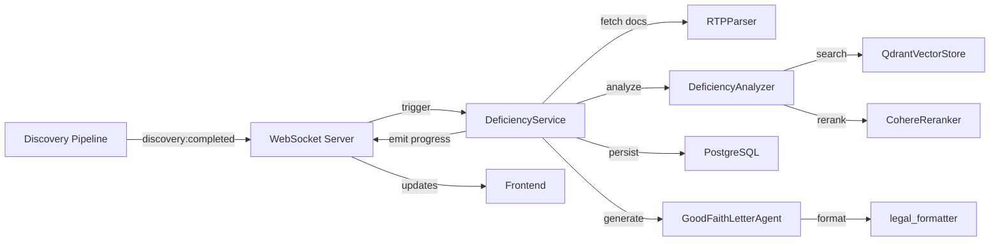

# Component Architecture

## New Components

**DeficiencyAnalyzer**
- **Responsibility:** AI agent that analyzes RTP requests against discovery productions
- **Integration Points:** 
  - Receives trigger from fact extraction completion
  - Queries Qdrant vector store for document matching
  - Outputs classifications to DeficiencyService

**Key Interfaces:**
- `analyze_rtp_item(request: RTPRequest, case_name: str) -> DeficiencyClassification`
- `search_production_documents(query: str, case_name: str, production_id: str) -> List[DocumentChunk]`

**Dependencies:**
- **Existing Components:** QdrantVectorStore, EmbeddingGenerator, CohereReranker
- **New Components:** RTPParser, DeficiencyService

**Technology Stack:** Python, OpenAI GPT-4, Qdrant hybrid search

**RTPParser**
- **Responsibility:** Extract and parse RTP requests from uploaded PDF documents
- **Integration Points:**
  - Receives PDF file path from discovery processing
  - Outputs structured RTP items to DeficiencyAnalyzer

**Key Interfaces:**
- `parse_rtp_document(pdf_path: str) -> List[RTPRequest]`
- `extract_request_number(text: str) -> str`

**Dependencies:**
- **Existing Components:** pdf_extractor, enhanced_chunker
- **New Components:** None

**Technology Stack:** Python, pdfplumber, regex parsing

**DeficiencyService**
- **Responsibility:** Orchestrates the complete deficiency analysis workflow
- **Integration Points:**
  - Listens for discovery:completed WebSocket events
  - Coordinates analysis across all components
  - Persists results to PostgreSQL

**Key Interfaces:**
- `process_deficiency_analysis(production_id: str, case_name: str) -> DeficiencyReport`
- `update_analysis_status(report_id: str, status: str) -> None`

**Dependencies:**
- **Existing Components:** WebSocket server, PostgreSQL connection
- **New Components:** DeficiencyAnalyzer, RTPParser, GoodFaithLetterAgent

**Technology Stack:** Python, FastAPI, asyncio, SQLAlchemy

**GoodFaithLetterAgent**
- **Responsibility:** Generate professional Good Faith letters from deficiency reports
- **Integration Points:**
  - Reads DeficiencyReport from database
  - Uses templates for letter generation
  - Outputs formatted letters

**Key Interfaces:**
- `generate_letter(report_id: str, template_name: str) -> GoodFaithLetter`
- `customize_letter(letter_id: str, modifications: Dict) -> GoodFaithLetter`

**Dependencies:**
- **Existing Components:** legal_formatter
- **New Components:** DeficiencyService

**Technology Stack:** Python, OpenAI GPT-4, Jinja2 templates

## Component Interaction Diagram

