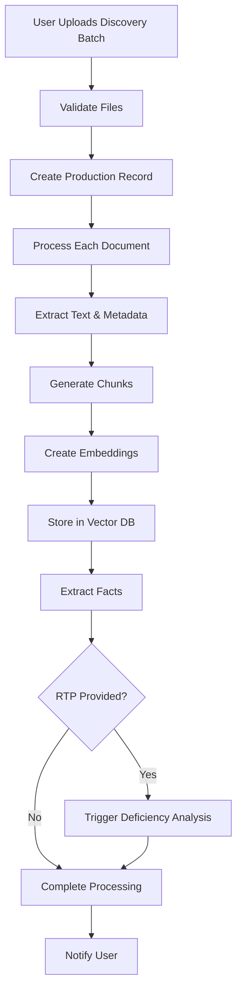
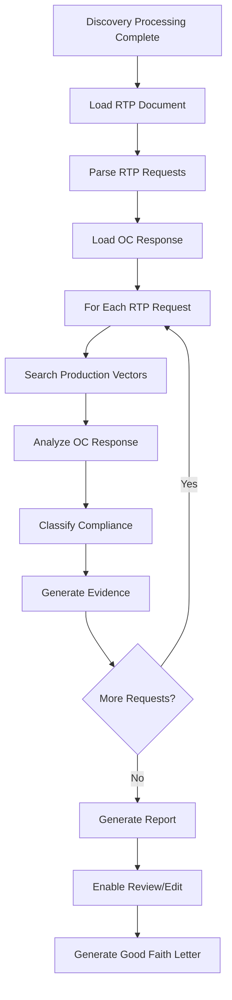
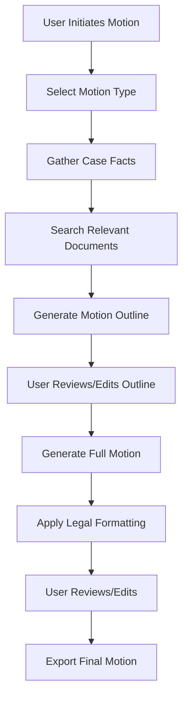
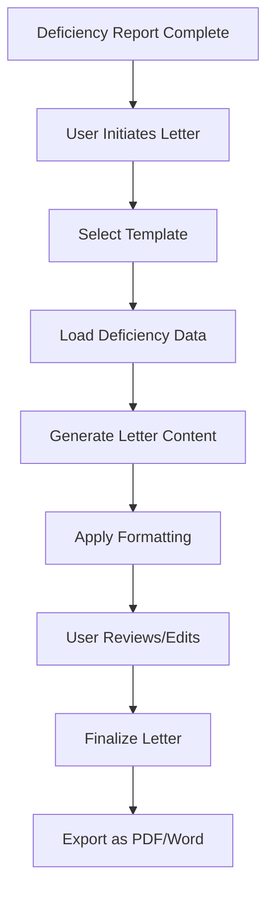
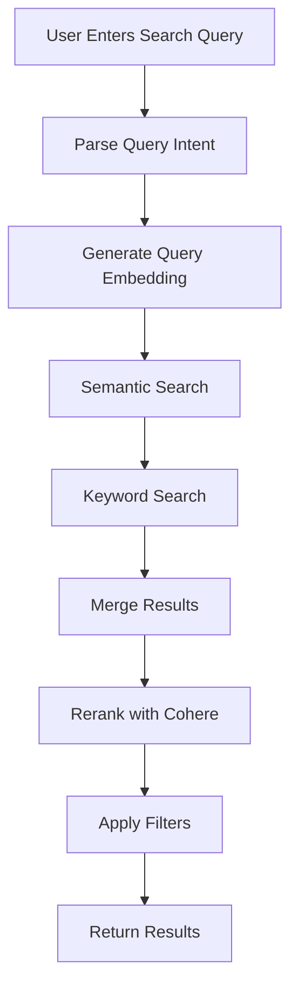
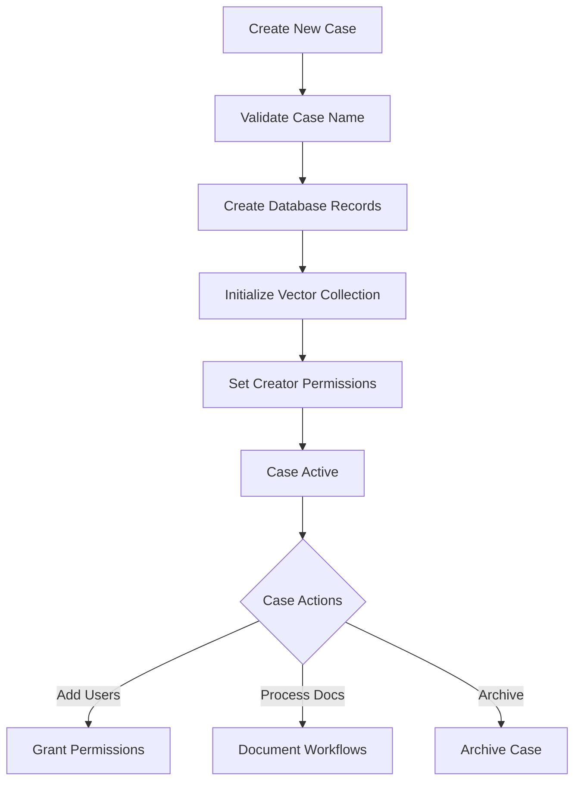

# Core Workflows

## Overview

This document describes the core business workflows in the Clerk Legal AI System. Each workflow details the end-to-end process, from user interaction through system processing to final output.

## Discovery Processing Workflow

### Overview
The discovery processing workflow handles the ingestion, analysis, and organization of legal discovery documents.

### Workflow Steps



### Detailed Process

#### 1. Document Upload
```typescript
// User initiates discovery upload
const handleDiscoveryUpload = async (files: File[], metadata: ProductionMetadata) => {
  // Validate file types and sizes
  const validFiles = files.filter(f => f.type === 'application/pdf');
  
  // Create form data with metadata
  const formData = new FormData();
  validFiles.forEach(file => formData.append('discovery_files', file));
  formData.append('rtp_document', rtpFile);
  formData.append('oc_response_document', ocResponseFile);
  formData.append('metadata', JSON.stringify(metadata));
  
  // Submit to API
  const response = await api.discovery.processProduction(formData);
  
  // Subscribe to WebSocket updates
  wsClient.subscribe(`discovery:${response.productionId}`);
};
```

#### 2. Backend Processing
```python
async def process_discovery_production(
    production_id: UUID,
    case_name: str,
    files: List[UploadFile]
) -> ProcessingResult:
    # Create production record
    production = await create_production_record(production_id, case_name)
    
    # Process documents in parallel
    tasks = []
    for file in files:
        task = process_document_async(file, production_id, case_name)
        tasks.append(task)
    
    # Emit progress updates
    async def update_progress(completed: int, total: int):
        await emit_websocket_event(
            f"discovery:progress",
            {
                "productionId": str(production_id),
                "completed": completed,
                "total": total,
                "percentage": (completed / total) * 100
            }
        )
    
    # Wait for all documents to process
    results = await asyncio.gather(*tasks)
    
    # Extract facts from documents
    facts = await extract_facts_from_production(production_id, case_name)
    
    # Trigger deficiency analysis if RTP provided
    if production.rtp_document_id:
        await trigger_deficiency_analysis(production_id)
    
    return ProcessingResult(
        production_id=production_id,
        documents_processed=len(results),
        facts_extracted=len(facts)
    )
```

#### 3. Document Processing Pipeline
```python
async def process_document_async(
    file: UploadFile,
    production_id: UUID,
    case_name: str
) -> DocumentResult:
    # Extract text from PDF
    text_content, metadata = await extract_pdf_content(file)
    
    # Create document record
    document = await create_document_record(
        file_name=file.filename,
        case_id=case_name,
        production_id=production_id,
        metadata=metadata
    )
    
    # Chunk document
    chunks = chunk_document(text_content, chunk_size=1400, overlap=200)
    
    # Generate embeddings
    embeddings = await generate_embeddings(chunks)
    
    # Store in vector database
    await store_document_vectors(
        case_name=case_name,
        document_id=document.id,
        chunks=chunks,
        embeddings=embeddings,
        metadata={
            "production_batch": production_id,
            "document_type": classify_document(text_content)
        }
    )
    
    return DocumentResult(
        document_id=document.id,
        chunks_created=len(chunks),
        status="completed"
    )
```

## Deficiency Analysis Workflow

### Overview
Automatically analyzes discovery productions against Request to Produce (RTP) documents to identify missing or incomplete productions.

### Workflow Steps



### Detailed Process

#### 1. RTP Parsing
```python
async def parse_rtp_document(
    rtp_document_id: UUID
) -> List[RTPItem]:
    # Load document content
    document = await get_document(rtp_document_id)
    content = await extract_text_from_pdf(document.file_path)
    
    # Use AI to identify and parse requests
    prompt = build_rtp_parsing_prompt(content)
    
    response = await openai_client.chat.completions.create(
        model="gpt-4",
        messages=[{"role": "user", "content": prompt}],
        response_format={"type": "json_object"}
    )
    
    # Parse response into structured items
    rtp_data = json.loads(response.choices[0].message.content)
    
    return [
        RTPItem(
            request_number=item["number"],
            request_text=item["text"],
            category=item["category"]
        )
        for item in rtp_data["requests"]
    ]
```

#### 2. Compliance Analysis
```python
async def analyze_rtp_compliance(
    rtp_item: RTPItem,
    oc_response: str,
    production_id: UUID,
    case_name: str
) -> DeficiencyClassification:
    # Check if OC claims no responsive documents
    if "no responsive documents" in oc_response.lower():
        return DeficiencyClassification(
            classification="no_responsive_docs",
            confidence_score=0.95,
            evidence=[]
        )
    
    # Search production for responsive documents
    search_results = await vector_store.hybrid_search(
        case_name=case_name,
        query_text=rtp_item.request_text,
        filters={"production_batch": str(production_id)},
        limit=50
    )
    
    # Rerank results for relevance
    reranked = await cohere_client.rerank(
        query=rtp_item.request_text,
        documents=[r.content for r in search_results],
        top_n=20
    )
    
    # Analyze with AI
    analysis_prompt = build_compliance_analysis_prompt(
        rtp_request=rtp_item.request_text,
        oc_response=oc_response,
        found_documents=reranked.results
    )
    
    response = await openai_client.chat.completions.create(
        model="gpt-4",
        messages=[{"role": "user", "content": analysis_prompt}],
        temperature=0.1
    )
    
    # Parse classification
    classification_data = json.loads(response.choices[0].message.content)
    
    return DeficiencyClassification(
        classification=classification_data["classification"],
        confidence_score=classification_data["confidence"],
        evidence=[
            Evidence(
                document_id=doc["document_id"],
                chunk_text=doc["text"],
                relevance_score=doc["score"],
                page_numbers=doc["pages"]
            )
            for doc in classification_data["evidence"]
        ]
    )
```

#### 3. Report Generation
```python
async def generate_deficiency_report(
    analysis_results: List[AnalysisResult],
    production_id: UUID,
    case_id: UUID
) -> DeficiencyReport:
    # Calculate summary statistics
    summary = {
        "total_requests": len(analysis_results),
        "fully_produced": sum(1 for r in analysis_results 
                             if r.classification == "fully_produced"),
        "partially_produced": sum(1 for r in analysis_results 
                                if r.classification == "partially_produced"),
        "not_produced": sum(1 for r in analysis_results 
                          if r.classification == "not_produced"),
        "no_responsive_docs": sum(1 for r in analysis_results 
                                if r.classification == "no_responsive_docs")
    }
    
    # Create report record
    report = await create_deficiency_report(
        case_id=case_id,
        production_id=production_id,
        summary_statistics=summary
    )
    
    # Create deficiency items
    for result in analysis_results:
        await create_deficiency_item(
            report_id=report.id,
            request_number=result.rtp_item.request_number,
            request_text=result.rtp_item.request_text,
            oc_response_text=result.oc_response,
            classification=result.classification,
            confidence_score=result.confidence_score,
            evidence_chunks=result.evidence
        )
    
    # Emit completion event
    await emit_websocket_event(
        "deficiency:completed",
        {
            "reportId": str(report.id),
            "productionId": str(production_id),
            "summary": summary
        }
    )
    
    return report
```

## Motion Generation Workflow

### Overview
Generates legal motions based on case facts and legal research, with AI assistance for drafting.

### Workflow Steps



### Detailed Process

#### 1. Motion Outline Generation
```python
async def generate_motion_outline(
    motion_type: str,
    case_name: str,
    party: str,
    key_facts: List[str]
) -> MotionOutline:
    # Search for relevant case documents
    relevant_docs = await search_case_documents(
        case_name=case_name,
        query=f"{motion_type} {' '.join(key_facts[:3])}",
        limit=50
    )
    
    # Search shared legal resources
    legal_precedents = await search_shared_resources(
        collections=["case_law_precedents", "federal_rules"],
        query=motion_type,
        limit=20
    )
    
    # Build context for AI
    context = build_motion_context(
        motion_type=motion_type,
        party=party,
        key_facts=key_facts,
        case_documents=relevant_docs,
        legal_precedents=legal_precedents
    )
    
    # Generate outline with AI
    response = await openai_client.chat.completions.create(
        model="gpt-4",
        messages=[
            {"role": "system", "content": MOTION_OUTLINE_SYSTEM_PROMPT},
            {"role": "user", "content": context}
        ],
        temperature=0.3
    )
    
    # Parse outline structure
    outline_data = parse_motion_outline(response.choices[0].message.content)
    
    return MotionOutline(
        motion_type=motion_type,
        title=outline_data["title"],
        sections=[
            OutlineSection(
                name=section["name"],
                subsections=section.get("subsections", []),
                key_points=section["key_points"],
                suggested_cases=section.get("cases", [])
            )
            for section in outline_data["sections"]
        ]
    )
```

#### 2. Full Motion Generation
```python
async def generate_motion_draft(
    outline: MotionOutline,
    case_name: str,
    style: str = "formal",
    jurisdiction: str = "federal"
) -> DraftedMotion:
    # Process each section
    drafted_sections = []
    
    for section in outline.sections:
        # Generate section content
        section_prompt = build_section_prompt(
            section=section,
            style=style,
            jurisdiction=jurisdiction
        )
        
        response = await openai_client.chat.completions.create(
            model="gpt-4",
            messages=[
                {"role": "system", "content": LEGAL_DRAFTER_SYSTEM_PROMPT},
                {"role": "user", "content": section_prompt}
            ],
            temperature=0.2,
            max_tokens=2000
        )
        
        drafted_sections.append({
            "name": section.name,
            "content": response.choices[0].message.content
        })
    
    # Combine sections with proper formatting
    full_content = format_motion_document(
        title=outline.title,
        sections=drafted_sections,
        jurisdiction=jurisdiction
    )
    
    # Extract and format citations
    citations = extract_legal_citations(full_content)
    formatted_content = format_legal_citations(full_content, citations)
    
    # Create motion record
    motion = await create_drafted_motion(
        case_id=case_name,
        outline_id=outline.id,
        motion_type=outline.motion_type,
        title=outline.title,
        content=formatted_content,
        citations=citations
    )
    
    return motion
```

## Good Faith Letter Generation Workflow

### Overview
Generates professional Good Faith letters based on deficiency analysis findings.

### Workflow Steps



### Detailed Process

#### 1. Letter Generation
```python
async def generate_good_faith_letter(
    deficiency_report_id: UUID,
    template: str,
    deadline_days: int = 10
) -> GoodFaithLetter:
    # Load deficiency report with items
    report = await get_deficiency_report_with_items(deficiency_report_id)
    
    # Calculate deadline
    deadline_date = datetime.now() + timedelta(days=deadline_days)
    
    # Group deficiencies by classification
    deficiencies_by_type = group_deficiencies(report.items)
    
    # Load letter template
    template_content = load_letter_template(template)
    
    # Generate letter content
    letter_prompt = build_letter_prompt(
        template=template_content,
        deficiencies=deficiencies_by_type,
        deadline_date=deadline_date,
        case_info=report.case_info
    )
    
    response = await openai_client.chat.completions.create(
        model="gpt-4",
        messages=[
            {"role": "system", "content": LEGAL_LETTER_SYSTEM_PROMPT},
            {"role": "user", "content": letter_prompt}
        ],
        temperature=0.3
    )
    
    # Format letter
    formatted_letter = format_legal_letter(
        content=response.choices[0].message.content,
        sender_info=get_user_firm_info(),
        recipient_info=report.opposing_counsel_info,
        date=datetime.now()
    )
    
    # Create letter record
    letter = await create_good_faith_letter(
        case_id=report.case_id,
        deficiency_report_id=deficiency_report_id,
        template_id=template,
        content=formatted_letter,
        deadline_date=deadline_date
    )
    
    return letter
```

## Search Workflow

### Overview
Provides hybrid semantic and keyword search across case documents and shared legal resources.

### Workflow Steps



### Detailed Process

#### 1. Hybrid Search Implementation
```python
async def perform_hybrid_search(
    case_name: str,
    query: str,
    filters: Dict[str, Any],
    include_shared: bool = False
) -> SearchResults:
    # Parse query for special operators
    parsed_query = parse_search_query(query)
    
    # Generate embedding for semantic search
    query_embedding = await generate_embedding(parsed_query.text)
    
    # Perform semantic search
    semantic_results = await vector_store.search(
        collection_name=case_name,
        query_vector=query_embedding,
        limit=100,
        score_threshold=0.7
    )
    
    # Perform keyword search
    keyword_results = await vector_store.search_by_payload(
        collection_name=case_name,
        filters={
            "must": [
                {"key": "content", "match": {"text": parsed_query.text}}
            ]
        },
        limit=100
    )
    
    # Search shared resources if requested
    shared_results = []
    if include_shared:
        for collection in SHARED_COLLECTIONS:
            results = await vector_store.search(
                collection_name=collection,
                query_vector=query_embedding,
                limit=20
            )
            shared_results.extend(results)
    
    # Merge and deduplicate results
    all_results = merge_search_results(
        semantic_results,
        keyword_results,
        shared_results
    )
    
    # Rerank with Cohere
    if len(all_results) > 10:
        reranked = await cohere_client.rerank(
            query=query,
            documents=[r.content for r in all_results],
            top_n=50
        )
        
        # Reorder results based on reranking
        all_results = reorder_by_rerank_scores(all_results, reranked)
    
    # Apply post-search filters
    filtered_results = apply_search_filters(all_results, filters)
    
    return SearchResults(
        results=filtered_results[:20],
        total_count=len(filtered_results),
        search_time_ms=calculate_search_time()
    )
```

## Case Management Workflow

### Overview
Manages the lifecycle of legal cases, including creation, permissions, and archival.

### Workflow Steps



### Detailed Process

#### 1. Case Creation
```python
async def create_case_workflow(
    case_name: str,
    law_firm_id: UUID,
    user_id: UUID,
    metadata: Dict[str, Any]
) -> Case:
    # Validate case name format
    if not validate_case_name(case_name):
        raise InvalidCaseNameError(
            "Case name must be alphanumeric with underscores"
        )
    
    # Check uniqueness
    if await case_exists(case_name):
        raise CaseAlreadyExistsError(f"Case '{case_name}' already exists")
    
    # Create case record
    case = await create_case_record(
        name=case_name,
        law_firm_id=law_firm_id,
        created_by=user_id,
        metadata=metadata
    )
    
    # Initialize vector collection
    await vector_store.create_collection(
        collection_name=case_name,
        vectors_config=VectorParams(
            size=1536,
            distance=Distance.COSINE
        )
    )
    
    # Grant creator admin permissions
    await grant_case_permission(
        case_id=case.id,
        user_id=user_id,
        permission="admin",
        granted_by=user_id
    )
    
    # Log case creation
    await log_audit_event(
        case_id=case.id,
        action="case_created",
        user_id=user_id,
        details={"law_firm_id": str(law_firm_id)}
    )
    
    return case
```

## Error Recovery Workflows

### Document Processing Failure
```python
async def handle_document_processing_failure(
    document_id: UUID,
    error: Exception,
    retry_count: int = 0
) -> None:
    # Log error
    logger.error(f"Document {document_id} processing failed", exc_info=error)
    
    # Update document status
    await update_document_status(document_id, "failed", str(error))
    
    # Retry logic
    if retry_count < MAX_RETRIES and is_retryable_error(error):
        await schedule_retry(
            task="process_document",
            document_id=document_id,
            retry_count=retry_count + 1,
            delay=calculate_backoff_delay(retry_count)
        )
    else:
        # Notify user of failure
        await notify_processing_failure(document_id, error)
```

### WebSocket Disconnection Recovery
```typescript
class WebSocketReconnection {
  private reconnectAttempts = 0;
  private maxReconnectAttempts = 5;
  
  async handleDisconnection() {
    while (this.reconnectAttempts < this.maxReconnectAttempts) {
      try {
        await this.reconnect();
        this.reconnectAttempts = 0;
        this.resubscribeToChannels();
        break;
      } catch (error) {
        this.reconnectAttempts++;
        await this.wait(Math.pow(2, this.reconnectAttempts) * 1000);
      }
    }
  }
  
  private async reconnect() {
    this.socket = io(WS_URL, { auth: { token: this.getToken() } });
    await this.waitForConnection();
  }
  
  private resubscribeToChannels() {
    this.subscribedChannels.forEach(channel => {
      this.socket.emit('subscribe', { case_id: channel });
    });
  }
}
```

## Performance Optimization Strategies

### Batch Processing
```python
async def batch_process_documents(
    documents: List[Document],
    batch_size: int = 10
) -> List[ProcessingResult]:
    results = []
    
    for i in range(0, len(documents), batch_size):
        batch = documents[i:i + batch_size]
        
        # Process batch in parallel
        batch_tasks = [
            process_document_async(doc)
            for doc in batch
        ]
        
        batch_results = await asyncio.gather(*batch_tasks)
        results.extend(batch_results)
        
        # Emit progress
        progress = (i + len(batch)) / len(documents) * 100
        await emit_progress_update(progress)
    
    return results
```

### Caching Strategy
```python
class WorkflowCache:
    def __init__(self):
        self.cache = TTLCache(maxsize=1000, ttl=3600)
    
    async def get_or_compute(
        self,
        key: str,
        compute_func: Callable,
        *args,
        **kwargs
    ):
        if key in self.cache:
            return self.cache[key]
        
        result = await compute_func(*args, **kwargs)
        self.cache[key] = result
        return result
```

## Monitoring and Analytics

### Workflow Metrics
```python
class WorkflowMetrics:
    async def track_workflow_execution(
        self,
        workflow_name: str,
        case_id: UUID,
        duration_ms: float,
        success: bool,
        metadata: Dict[str, Any]
    ):
        await self.store_metric({
            "workflow": workflow_name,
            "case_id": str(case_id),
            "duration_ms": duration_ms,
            "success": success,
            "timestamp": datetime.utcnow(),
            "metadata": metadata
        })
```

### User Activity Tracking
```python
async def track_user_activity(
    user_id: UUID,
    action: str,
    resource_type: str,
    resource_id: UUID,
    case_id: UUID
):
    await create_activity_log({
        "user_id": user_id,
        "action": action,
        "resource_type": resource_type,
        "resource_id": resource_id,
        "case_id": case_id,
        "timestamp": datetime.utcnow(),
        "ip_address": get_client_ip(),
        "user_agent": get_user_agent()
    })
```